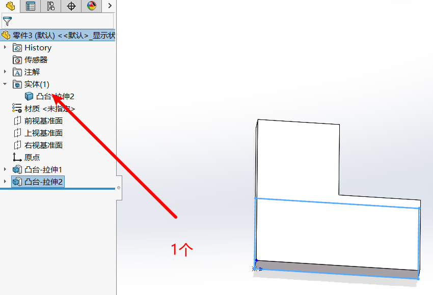
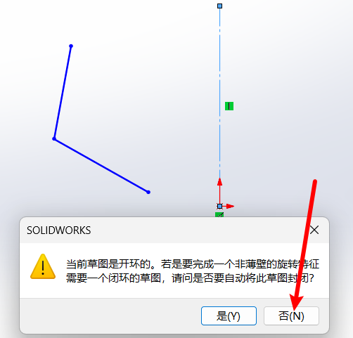
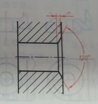
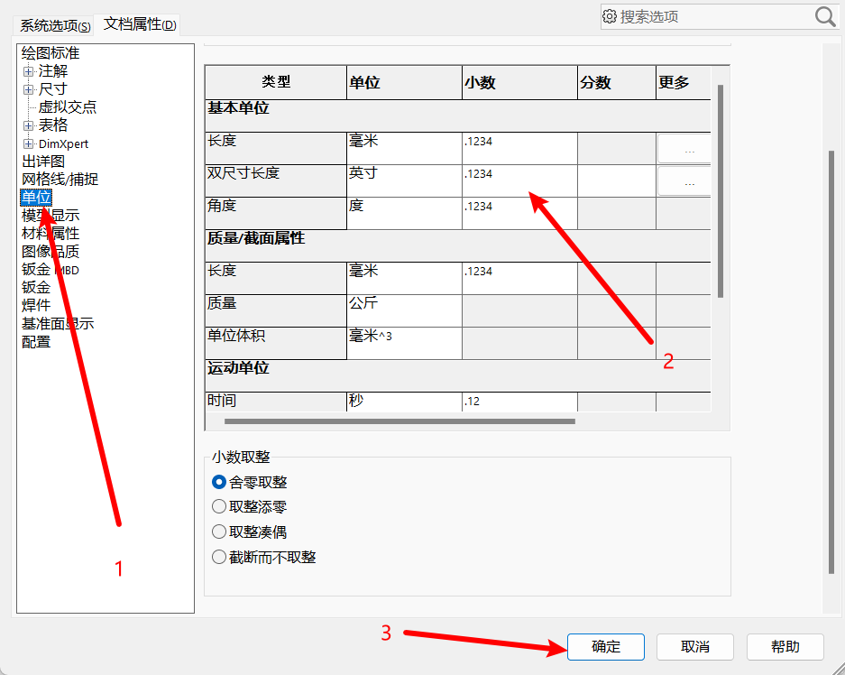
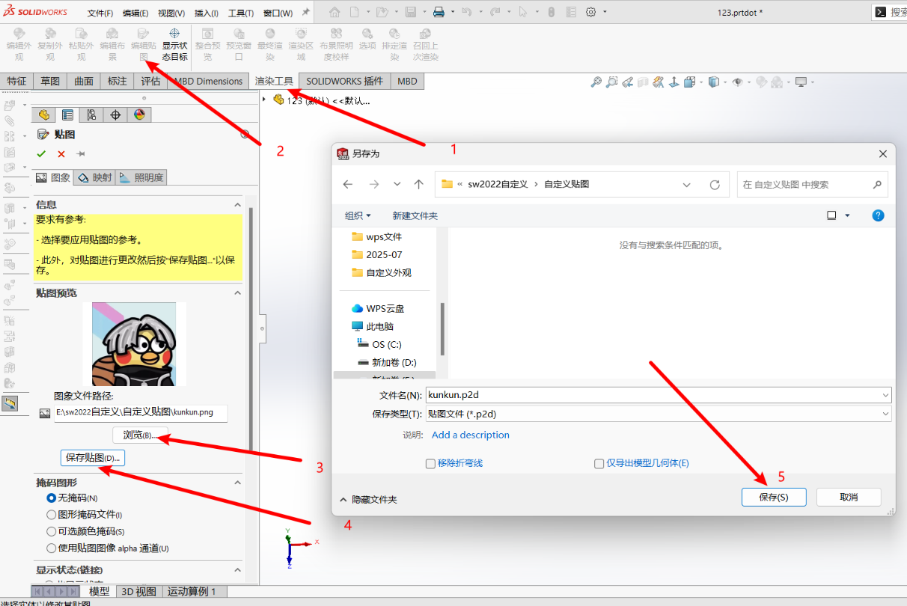
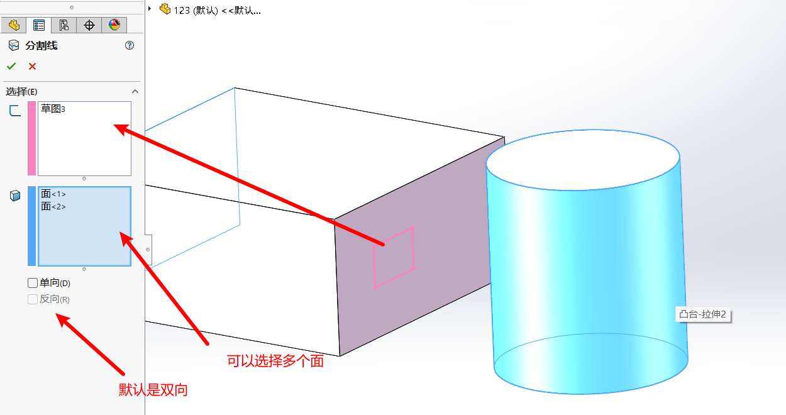

## 目录
<!-- TOC -->
- [目录](#目录)
- [1.软件介绍](#1软件介绍)
- [2.软件基本设置](#2软件基本设置)
  - [2.1 新建](#21-新建)
  - [2.2 界面介绍](#22-界面介绍)
    - [菜单栏](#菜单栏)
    - [标准工具栏](#标准工具栏)
    - [状态栏](#状态栏)
    - [FeatureManager 设计树](#featuremanager-设计树)
    - [绘图区](#绘图区)
  - [2.3 鼠标的各种使用方法：](#23-鼠标的各种使用方法)
- [3.草图模块](#3草图模块)
  - [3.1 草图的进入和退出，直线的相关命令](#31-草图的进入和退出直线的相关命令)
    - [草图的进入退出](#草图的进入退出)
    - [直线的相关命令](#直线的相关命令)
  - [3.2 圆，矩形，圆弧，槽口命令](#32-圆矩形圆弧槽口命令)
    - [圆](#圆)
    - [矩形](#矩形)
    - [圆弧](#圆弧)
    - [槽口](#槽口)
  - [3.3 多边形，椭圆，点，文字，样条曲线](#33-多边形椭圆点文字样条曲线)
    - [多边形](#多边形)
    - [椭圆](#椭圆)
    - [点](#点)
    - [文字](#文字)
    - [样条曲线](#样条曲线)
    - [补充](#补充)
      - [上色草图轮廓](#上色草图轮廓)
      - [正视于](#正视于)
      - [视图定向](#视图定向)
  - [3.4 鼠标笔势，图形的选择和删除](#34-鼠标笔势图形的选择和删除)
    - [鼠标笔势](#鼠标笔势)
    - [图形的选择和删除](#图形的选择和删除)
  - [3.5 软件自动添加几何约束](#35-软件自动添加几何约束)
  - [3.6 手动添加几何约束](#36-手动添加几何约束)
  - [3.7 智能尺寸和草图的状态](#37-智能尺寸和草图的状态)
    - [智能尺寸](#智能尺寸)
    - [草图的状态](#草图的状态)
    - [尺寸的分类](#尺寸的分类)
      - [驱动尺寸](#驱动尺寸)
      - [从动尺寸](#从动尺寸)
  - [3.8 倒圆角，倒斜角，剪裁实体](#38-倒圆角倒斜角剪裁实体)
    - [倒圆角](#倒圆角)
    - [倒斜角](#倒斜角)
    - [剪裁实体](#剪裁实体)
  - [3.9 文档属性的认识](#39-文档属性的认识)
  - [3.10 草图按第一个尺寸进行缩放的优点](#310-草图按第一个尺寸进行缩放的优点)
  - [3.11 镜像实体](#311-镜像实体)
  - [3.12 线性阵列](#312-线性阵列)
  - [3.13 圆周阵列](#313-圆周阵列)
  - [3.14 等距实体和延伸实体](#314-等距实体和延伸实体)
    - [等距实体](#等距实体)
    - [延伸实体](#延伸实体)
  - [3.15 转折线命令](#315-转折线命令)
  - [3.16 转换实体引用](#316-转换实体引用)
  - [3.17 分割实体](#317-分割实体)
  - [3.18 移动，复制，旋转，缩放，伸展实体](#318-移动复制旋转缩放伸展实体)
    - [旋转实体](#旋转实体)
    - [缩放实体](#缩放实体)
    - [移动实体](#移动实体)
    - [复制实体](#复制实体)
    - [伸展实体](#伸展实体)
  - [3.19 小结](#319-小结)
- [4.特征模块](#4特征模块)
  - [4.1 生成特征的两种方式](#41-生成特征的两种方式)
  - [4.2 拉伸凸台/基体](#42-拉伸凸台基体)
    - [拉伸起点](#拉伸起点)
    - [拉伸方式](#拉伸方式)
    - [拔模](#拔模)
    - [薄壁特征](#薄壁特征)
  - [4.3 拉伸切除](#43-拉伸切除)
    - [切除起点](#切除起点)
    - [切除方式](#切除方式)
  - [4.4 基本视图](#44-基本视图)
  - [4.5 设计树的操作](#45-设计树的操作)
  - [4.6 草图轮廓的反复使用](#46-草图轮廓的反复使用)
  - [4.7 布尔运算](#47-布尔运算)
    - [拉伸凸台合并结果的说明](#拉伸凸台合并结果的说明)
    - [组合工具](#组合工具)
  - [4.8 相交](#48-相交)
  - [4.9 旋转凸台 / 基体](#49-旋转凸台--基体)
  - [4.10 旋转切除](#410-旋转切除)
  - [4.11 简单放置特征：圆角、倒角、圆顶](#411-简单放置特征圆角倒角圆顶)
    - [简述](#简述)
    - [圆角](#圆角)
      - [圆角类型](#圆角类型)
        - [固定大小圆角(重点掌握)](#固定大小圆角重点掌握)
        - [FilletXpert (圆角专家)](#filletxpert-圆角专家)
        - [变量大小圆角](#变量大小圆角)
        - [面圆角](#面圆角)
        - [完整圆角](#完整圆角)
    - [倒角](#倒角)
    - [圆顶](#圆顶)
  - [4.12 基准面的创建](#412-基准面的创建)
  - [4.13 基准轴，坐标系，点](#413-基准轴坐标系点)
    - [基准轴](#基准轴)
    - [坐标系](#坐标系)
    - [点](#点-1)
  - [4.14 扫描凸台](#414-扫描凸台)
    - [扫描凸台](#扫描凸台)
    - [SelectionManager](#selectionmanager)
    - [引导线扫描](#引导线扫描)
  - [4.15 扫描切除](#415-扫描切除)
  - [4.16 放样凸台 / 基体](#416-放样凸台--基体)
    - [放样凸台](#放样凸台)
    - [引导线放样凸台](#引导线放样凸台)
    - [中心线放样凸台](#中心线放样凸台)
  - [4.17 软件的快捷键的设置](#417-软件的快捷键的设置)
  - [4.18 转换实体引用](#418-转换实体引用)
  - [4.19 侧影实体和交叉曲线](#419-侧影实体和交叉曲线)
    - [侧影实体](#侧影实体)
    - [交叉曲线](#交叉曲线)
  - [4.20 测量,质量属性,截面属性](#420-测量质量属性截面属性)
    - [测量](#测量)
    - [质量属性](#质量属性)
    - [截面属性](#截面属性)
  - [4.21 文档属性](#421-文档属性)
    - [制作自己的零件模板](#制作自己的零件模板)
    - [小数取整](#小数取整)
  - [4.22 外观，布景，贴图](#422-外观布景贴图)
    - [外观](#外观)
      - [外观](#外观-1)
      - [外观的多状态显示](#外观的多状态显示)
      - [外观的自定义](#外观的自定义)
    - [布景](#布景)
      - [布景](#布景-1)
      - [自定义布景](#自定义布景)
    - [贴图](#贴图)
      - [贴图](#贴图-1)
      - [自定义贴图](#自定义贴图)
  - [4.23 分割线](#423-分割线)
    - [投影](#投影)
    - [轮廓](#轮廓)
    - [交叉点](#交叉点)
  - [4.24 投影曲线](#424-投影曲线)
  - [4.25 组合曲线](#425-组合曲线)
  - [4.26 螺旋线和涡状线](#426-螺旋线和涡状线)
  - [4.27 抽壳](#427-抽壳)
  - [4.28 拔模](#428-拔模)
    - [介绍](#介绍)
    - [使用](#使用)
      - [手工模式](#手工模式)
      - [DraftXpert模式](#draftxpert模式)
      - [拔模分析](#拔模分析)
  - [4.29 筋](#429-筋)
  - [4.30 包覆](#430-包覆)
  - [4.31 异形孔向导-准备知识](#431-异形孔向导-准备知识)
    - [螺纹的要素](#螺纹的要素)
    - [螺纹的画法](#螺纹的画法)
    - [螺纹紧固件](#螺纹紧固件)
    - [螺纹紧固件的连接及其画法](#螺纹紧固件的连接及其画法)
    - [孔的尺寸注法](#孔的尺寸注法)
  - [4.32 异型孔向导](#432-异型孔向导)
  - [4.33 高级孔](#433-高级孔)
  - [4.34 螺纹线和装饰螺纹线](#434-螺纹线和装饰螺纹线)
  - [4.35 螺柱向导](#435-螺柱向导)
  - [4.36 移动复制实体,删除保留实体](#436-移动复制实体删除保留实体)
    - [移动复制实体](#移动复制实体)
    - [删除保留实体](#删除保留实体)
  - [4.37 镜像](#437-镜像)
  - [4.38 阵列](#438-阵列)
    - [线性阵列](#线性阵列)
<!-- /TOC -->

## 1.软件介绍

SolidWorks 软件是美国 SolidWorks 公司 (1997 年被法国达索公司收购) 推出的基于 Windows 的机械设计软件。SolidWorks 是基于 Windows 平台的全参数化特征造型软件，它可以十分方便地实现复杂的三维零件实体造型、复杂装配和生成工程图等等。

SolidWorks 因其功能强大、易学易用等特点，目前已经成为市场上领先的、主流的三维 CAD 解决方案软件。其应用涉及平面工程制图、三维造型、加工制造、非标自动化等领域。

SolidWorks 简称 **SW**

## 2.软件基本设置

### 2.1 新建
打开软件双击空白处，然后就可以选择新建以下三种文件。

### 2.2 界面介绍

#### 菜单栏
菜单栏中包含 SOLIDWORKS 的所有操作命令。
#### 标准工具栏
与其他标准的 Windows 程序一样，标准工具栏中的工具按钮用来对文件执行最基本的操作，如新建、打开、保存、打印等。
#### 状态栏
状态栏位于 SOLIDWORKS 用户界面底端的水平区域，提供了当前窗口中正在编辑的内容的状态，以及位置坐标、草图状态等信息。
#### FeatureManager 设计树
FeatureManager 设计树位于 SOLIDWORKS 用户界面的左侧，是 SOLIDWORKS 中比较常用的部分。它提供了软件操作的一个大纲视图，用户可以方便查看模型的构造等相关信息。
#### 绘图区
绘图区是进行零件设计、制作工程图、装配的主要操作窗口。

### 2.3 鼠标的各种使用方法：
**鼠标左键**：选择功能
**滚轮的滚动**：视图的缩放
**按住键盘上的 Ctrl 和按住滚轮移动**：平移视图
**按住滚轮移动**：翻转视图 (方便各个视角查看)
**连续按下滚轮两次**：可以显示全部图形
**鼠标右键**：在不同的位置与场景有不同的功能,后续会慢慢介绍

## 3.草图模块

### 3.1 草图的进入和退出，直线的相关命令

#### 草图的进入退出
点击草图绘制，然后选择一个基准面

绘制完草图，点击如图左上角或右上角退出草图

#### 直线的相关命令
**首先进入草图绘制模式:**
**直线**：L (英文状态下，快捷键) 
**退出命令**：Esc 
**重复上个命令**：回车键 (Enter)
**撤销 (或叫回撤)**:Ctrl+Z (回到上一步) 
**直线和圆弧的切换**：按键盘上的 A (英文状态下)

也可以直接点击操作面板上的直线图标，如图下：

### 3.2 圆，矩形，圆弧，槽口命令

这些图标都在上面那个图可以看见，和直线图标挨着，以下介绍一些常用的：

#### 圆
分别是圆心半径圆、周边圆

#### 矩形
前两个分别是边角矩形、中心矩形

添加构造直线(中心线又叫构造线，起辅助作用，但是不参与特征)，从边角和中点的区别：

#### 圆弧
分别是圆心起始终止画弧、3 点圆弧、切线弧

#### 槽口
直槽口、中心点直槽口、3 点圆弧槽口、中心点圆弧槽口

### 3.3 多边形，椭圆，点，文字，样条曲线

#### 多边形
各条边的边长都相等,可以选择内接圆或者外接圆

#### 椭圆
这里常用的有两种：椭圆和部分椭圆

#### 点
绘制一个点

#### 文字
可以在草图中绘制你想要的文字，文字位置默认在原点，也可以通过拖动改变文字的位置

#### 样条曲线
样条曲线是指通过给定一组控制点得到的一条光滑曲线，曲线在各点处的一阶和二阶导数连续（端点除外），它具有连续的、曲率变化均匀的特点。样条曲线在一般的机械设计中应用并不多，但在造型设计等领域的应用非常常见。

有三个要介绍的：样条曲线，样式样条曲线，方程式驱动的曲线

**样条曲线**:由曲线上的点进行控制
**样式样条曲线**:由虚线上的点进行控制
**方程式驱动的曲线**:由方程进行控制，通过输入方程y 以及x的取值范围可以生成，默认也是在原点，可以拖动

#### 补充

##### 上色草图轮廓

启用后可以将封闭图形进行上色，可以更好的分辨

##### 正视于

在翻转草图的时候点击正视于可以快速回到垂直于草图视图的视角

##### 视图定向
可以快速定位到当前草图的上视图，左视图等各个视图

### 3.4 鼠标笔势，图形的选择和删除

#### 鼠标笔势
使用鼠标笔势可以加快我们的绘图效率，长按鼠标右键呼出笔势

还未设置鼠标笔势可以先：选择上方的小齿轮右边的小三角形 -> 选择自定义 -> 选择鼠标笔势一栏 -> 勾上启用鼠标笔势

#### 图形的选择和删除

首先处于选择状态下：
**图形的选择方式**：点选、框选(选中的实体呈现青色)
从左至右：实体全部在框里面才会被选中；
从右至左：实体只要和框有接触就会被选中。

**图形的删除**：键盘上的 Delete

### 3.5 软件自动添加几何约束

**几何约束**：控制草图的位置、形状以及草图里面各实体之间的关系等
首先要记得开启**关系捕捉**

在画图的时候，可以看见黄色的小图标，意思是显示在自动捕捉约束中，并且画完后这个小图标变成绿色，即该实体被添加了该约束

还有可能是白色小图标，这种情况下画完之后不会添加该约束

以下是常见的几何关系：

### 3.6 手动添加几何约束

**1软件中的 “添加几何关系”**

**2键盘上的 Ctrl 键 (常用方式)**
按住ctrl就可以进行实体的多个选择，选中后就可以在左边选择几何关系

**3通常直接框选也可以 (重点掌握)**
[图形的选择](#图形的选择和删除)

### 3.7 智能尺寸和草图的状态

#### 智能尺寸
主要介绍前面三个：**智能尺寸，水平尺寸，垂直尺寸**

**智能尺寸**顾名思义就是带点智能的尺寸标注，可以根据鼠标的动作识别你想要标注的是什么的尺寸，如下：
标注直线的的时候鼠标往左边或者右边进行挪动，就自动识别出你想要标注的是**竖直尺寸**，往上或下就是**水平尺寸**

**水平尺寸，竖直尺寸**这个就是字面意思了

圆弧半径，圆的直径，以及两条线之间的距离，角度等等都可以使用智能尺寸快速标注

默认情况下都是标注圆心，所以想标注圆上的点或者弧长可以使用以下的一些方法：
**圆周上的尺寸标注**：按住键盘上的 Shift
**圆弧弧长的标注**：依次点选两个端点、圆弧

#### 草图的状态

在草图绘制中这个软件要求必须要和**原点发生位置关联**，如下，原本为蓝色代表欠定义，添加了与原点的关系后草图变为黑色，代表完全定义了

现在继续添加一个角度的约束，草图变为黄色，显示过定义，所以并不能随意添加约束，确保草图处于完全定义的状态

#### 尺寸的分类

分为**驱动尺寸**和**从动尺寸**：

##### 驱动尺寸
我们通过了两个几何约束和三个尺寸约束将草图完全定义了，这里将确定草图的**大小，尺寸，位置**的尺寸称为驱动尺寸

##### 从动尺寸
继续在三角形的另一条边加一个尺寸约束，软件会提示你设置为驱动尺寸或者从动尺寸，选择驱动尺寸会导致草图过定义(因为草图已经完全定义，多一个约束反而不行)，选择设置为从动尺寸将会看到一个灰色的标注，上面的值是根据驱动尺寸所得出的，驱动尺寸的变化会使得从动尺寸发生变化

### 3.8 倒圆角，倒斜角，剪裁实体

#### 倒圆角
**倒角**：倒圆角、倒斜角。
**倒圆角**：将两个草图实体相交处的边角圆角化、以创建一条**切线弧**。可以选择两个草图实体或选择一个边角。如果选择的实体不相交，则实体将延伸到带倒角边角的虚拟交叉点。两个选项框一般都勾选上。

点击绘制圆角，选择要圆角的实体(点，两条直线等)，可以设置圆角的半径，绘制完成后圆角的半径会自动标注。下面的选项中，标注每个圆角的尺寸意思是会将每一个圆角标注一遍半径，没勾上时绘制多个半径相等的圆角则只会自动标注其中一个，其它的圆角使用相等的几何约束

**注意**：构造线从中点引出的中心矩形最好不要用圆角
没注意可能出现以下情况：

点击是后发现草图过定义：
但是将几何约束中的中点约束删除就可以了

其实是因为绘制圆角的时候会挖掉线段的一部分，之前在中点的位置的点现在并不是位于中点导致了过定义警告。

#### 倒斜角
**倒斜角**：用一条斜线连接两个对象。
两种方式：**距离 - 距离**，**角度距离**。其中距离 - 距离可分为相等和不相等。在这几种方式中**距离 - 距离**中的相等最常应用。

**距离 - 距离**：设置倒斜角两边的尺寸绘制
**角度距离**：设置一条边的距离和一个角度绘制

#### 剪裁实体
可以方便的裁剪掉多余的不想要的部分
**图形的修剪**：有 5 种方式，**强劲剪裁**最常应用，大家目前掌握这种即可。
**注意**：剪裁以后有时候会丢失几何约束和尺寸约束，从而使完全定义变为欠定义，这个时候要补上丢失的约束。

轨迹为灰色的线条，可以将碰到的实体多余部分删除

### 3.9 文档属性的认识

这里有一个常见的小问题，就是默认的尺寸标注的数值不太清晰(我这里是sw2022)，那么可以通过以下的方式进行修改：

具体步骤：新建一个空白零件 -> 选项 -> 文档属性 -> 尺寸 -> 更改想要的字体 -> 确定 -> 保存为.prtdot 格式 -> 文件位置会自动跳到零件模板的位置 -> 命名时与之前的一致 -> 将原来的替换

这样下次新建零件的时候就是默认用的修改的字体了，其他的文档属性也可以用同样的进行修改，步骤一样。

### 3.10 草图按第一个尺寸进行缩放的优点

**可以防止草图的严重变形**

**注意**：有时候即使勾选上了这个，草图还是会变形，所以绘制草图时为了最好边画边约束。

### 3.11 镜像实体

**镜像**：通过中心线（构造几何线）将一侧的草图实体对称到另外一侧得到新的草图

**注意**：绘制草图时为了防止草图变形严重，建议边画边约束。

**步骤**：点击镜像实体 -> 选择构造线和要镜像的实体 -> 确定

**复制**：不打钩镜像完成后就只存在镜像后的实体，原来的实体会消失

**建议**：可以直接用框选，然后点击镜像实体就可以快速镜像

### 3.12 线性阵列

**线性阵列**：将草图实体沿一个或者两个方向复制生成多个排列图形。

### 3.13 圆周阵列

**圆周阵列**：将草图实体沿一个指定大小的圆弧进行环状阵列。

操作和一些参数与线性阵列相似，简单看看

### 3.14 等距实体和延伸实体

#### 等距实体

**等距实体**：按照指定的距离偏移一个或者多个草图实体得到新的草图。**如果原始实体发生改变，则偏移实体也会改变。**
**直线等距**：保持平行。
**圆或圆弧等距**：保持同心以及半径的变化值等于等距值。

#### 延伸实体

**将草图实体延伸最近的边界**。在延伸草图实体时，如果两个方向都可以延伸，而只需要单一方向的延伸时，光标靠近需要延伸的一侧即可 (在执行该命令的过程中，实体延伸的结果预览会以**红色**显示)。

### 3.15 转折线命令

**转折线**：将草图实体线条（**直线**）以转折线的形式变为新的草图实体并自动添加几何约束。

可以对比以下添加了哪些约束

### 3.16 转换实体引用

功能是通过已有模型或草图，将其边线、草图轮廓等投影到**当前绘制草图的基准面**上形成新草图实体，引用实体改变，转换得到的新草图也相应改变，**在草图绘制和自上而下设计中常用**

### 3.17 分割实体

将一个**连续**的草图实体分割为两个草图实体，以方便进行其他操作。如果想再合并，选中分割点，按键盘上的 Delete 即可 (**注意需要保证分割点两端的线型均为实线**)
**直线分割**：自动添加共线的几何约束。
**圆或者圆弧分割**：自动添加全等 (既同心又等大) 的几何约束。

### 3.18 移动，复制，旋转，缩放，伸展实体

#### 旋转实体
(用得不多)
通过旋转**旋转中心**及要旋转的度数来旋转草图实体。

#### 缩放实体
(了解即可，用得很少)
通过基准点和比例因子对草图实体进行缩放。也可以根据需要在保留原缩放对象的基础上缩放草图。

#### 移动实体
 (了解即可，用得很少)
移动一个或者多个草图实体,原来的实体会消失

草图处于**欠定义**的状态时，如果想移动草图的某个点，鼠标左键 **(处于选择状态)** 接触到这个点按住不松开直接拖动即可。如果想平移某一部分草图实体，选中这部分实体，按住鼠标左键 (**处于选择状态**) 不松开接触到这部分的**除去点**的任意位置直接拖动即可。

#### 复制实体 
(了解即可，用得很少)
用于复制一个或者多个草图实体。

和移动实体的参数，使用方法一样，只不过最后完成的时候保留**原来和复制的**实体

#### 伸展实体 
(了解即可，用得很少)
通过基准点和坐标点对草图实体进行伸展。

和移动实体使用方法相似，使用时还可能破坏约束关系，用的少

### 3.19 小结

第三章到这里就差不多了，大家在遇到比较复杂的图形时不要慌张，找准**基准点**，注意观察，**边画边约束**！以及裁剪过程中一旦发现欠定义，要马上添加约束，不要等到裁剪完毕后再来补约束因为这个时候就很难找到丢失的约束！

下面就要开始进入特征模块了

## 4.特征模块

### 4.1 生成特征的两种方式

没有出现特征这一栏可以右键旁边的草图或者其它的 -> 选项卡 -> 勾上特征

**先草图后特征**：先绘制好草图，然后直接生成想要的特征。

**先特征后草图**：先确定想要的特征，再绘制草图。

### 4.2 拉伸凸台/基体

**拉伸凸台/基体**：将一个二维草图平面按着其设定方式沿着**与草图平面垂直的方向**拉伸一定距离形成三维实体。**草图轮廓要求闭环，草图轮廓最好不要自我相交，以及不能有多余的线条。建议初学者的草图轮廓封闭。**

**注意**：构造线不参与特征 

#### 拉伸起点

**1.草图基准面**
在当前的草图基准面上直接进行拉伸

**2.曲面/面/基准面**
自己指定一个面，在选取的面上进行拉伸

**3.顶点**
相当于将草图平移到该顶点相交的位置，然后进行拉伸

**4.等距**
相当于在该方向上平移当前草图一个给定的距离，然后再进行拉伸

**5.补充**
图中这一栏是指定拉伸方向，通常很少用，默认不选择

激活方向二，可以在两侧同时进行拉伸，并且可以设置不同的拉伸方式，一般也很少用到，了解就好了

#### 拉伸方式

**1.给定深度**
字面意思，给定多深，就拉伸多长

**2.完全贯穿**
会成型到该方向的模型的**最外侧的一个面**

**3.成形到顶点**
相当于将当前草图的基准面进行平移，平移到刚好与顶点相交，然后将选取的轮廓成型到这边

**4.成形到面**
成型到选取的任意面上

**5.到离指定面指定的距离**
给定距离和指定平面，将轮廓拉伸至离指定平面为给定距离的位置

**6.成形到实体**
选择一个实体，将轮廓成型至该方向上离实体最近的一个面

**7.两侧对称**
给定总深度，然后两侧进行成型

#### 拔模

**拔模**：在铸造或者注塑过程之中，为了能让模型方便地脱离模具，将平直的面做出一点斜度的方式。如果不这样做，模型脱离模具的过程是很困难的。

**1.拔模角度**
与当前的拉伸方向成的角度(锐角)

**2.向外拔模 / 向内拔模**
向轮廓内部倾斜 / 向轮廓外部倾斜

#### 薄壁特征

**拉伸薄壁**：草图轮廓可以开环也可以闭环。如果草图轮廓是一个开环图形，则 “拉伸凸台 / 基体” 工具自动选择薄壁。

**薄壁特征选项**：
**1.单向**
往一侧生成薄壁

**2.两侧对称**
给定总宽度，两侧同时生成薄壁

**3.双向**
同时控制两个方向的薄壁特征，给定不同的宽度

拉伸薄壁特征画出来的图形一般用拉伸凸台也能画，因此大家根据需要选择合适的方式就可以。

### 4.3 拉伸切除

**拉伸切除**：与拉伸凸台特征非常相似，区别就是拉伸凸台是生成三维实体，而拉伸切除就是在已有的三维实体上切除一部分，因此拉伸切除的前提条件是必须有三维实体。

操作和拉伸凸台是类似的，这里不过多缀述，只不过是拉伸出要切除的区域

#### 切除起点

**1.草图基准面**
**2.曲面 / 面 / 基准面**
**3.顶点**
**4.等距**

#### 切除方式

这里讲一下第三点就好了，其它的和拉伸凸台差不多

**1.给定深度**
**2.完全贯穿**
**3.完全贯穿 - 两者**
可以看到激活了两个方向，可以单独控制两个方向，取消第二个方向就变成了完全贯穿一个方向了

**4.成形到下一面**
**5.成形到顶点**
**6.成形到面**
**7.到离指定面指定的距离**
**8.成形到实体**
**9.两侧对称**

### 4.4 基本视图

物体的主视图方向一旦确定以后，其他基本视图与主视图的位置关系也随之确定。主视图方向的选取一般以最能反应物体的轮廓和结构为原则。

**两种视角**

我国采用的是第一视角画法，而美国、日本等国家采用的是第三视角画法。如果图纸上没有标注或者没有特殊说明，一般来说都是指第一视角画法。

**三视图**
能够正确的反应物体的长，宽，高尺寸的正投影工程图

画图的时候要注意选择正确对应的基准面进行绘制

### 4.5 设计树的操作

右键或者左键特征

**特征 和草图 的编辑**
方法一

有时候生成的特征或者草图有需要重新修改的地方，直接点击编辑图标就可重新进入编辑

方法二

右键注解，勾上显示特征尺寸，零件就会显示出所有的草图尺寸，你就可以直接进行编辑了

**特征的压缩**
将该特征进行隐藏

**特征 和 草图 的删除**
删除的话，选中特征或者草图按del键就好了

**草图基准面的编辑**
重新更改草图的基准面

**特征的父子关系**
如图设计树上的特征中，最上面那个特征是所有特征的基础，如果隐藏最上面那个，其他的也会跟着被隐藏，所以最上面那个是所有特征的父亲，当然，一些子特征也可能会有自己的子特征，或者并列关系的特征，通过画出的零件也可以看出来

### 4.6 草图轮廓的反复使用

对于有的模型来说，它的所有特征都可以由**同一个视图上的草图轮廓生成**，这个时候为了绘图的高效率，只需要画一个草图轮廓就可以。

### 4.7 布尔运算

首先讲一下关于拉伸凸台**合并**这一个参数的作用

#### 拉伸凸台合并结果的说明
这里我画好了一个矩形，现在再画一个，并且勾选上合并结果，接下来这两个矩形就会变成一个实体，而不是两个

在设计树上也可以观察到

在取消勾选合并结果的情况下，可以看见变成了两个不同的实体

**注意**：如果合并结果勾选上，则新生成的实体与之前的实体不能有面积为 0 的线接触。否则会报错:
**重建模型错误**
**不能生成此特征，因为这将导致厚度为零的几何体。**

#### 组合工具

**布尔运算**：将两个或两个以上的实体进行合并、求差、求交运算，进而生成新的实体。
**注意**：布尔运算的前提是要有**两个或两个以上的实体**并且实体之间有体积不为零的共同部分。

没有的：上方小齿轮旁边的三角形 -> 自定义 -> 快捷方式栏  -> 搜索组合 -> 拖放到工具栏

**还是使用上面的两个矩形实体演示**

**添加：合并**
合并成一个实体

**删减：求差**
相减剩下的部分

.png)

**共同：求交**
公共的部分

### 4.8 相交

**相交包含了组合的所有功能并且还具有组合没有的功能，使用起来更加方便和灵活。采用这个命令的时候需要去除哪一部分时直接点选就可以，非常方便。**

相交就是指实体和实体相交或者实体和面 (曲面或者基准面) 相交，进行加减等运算，进而生成新的实体。

**创建交叉区域**
直接点击不想要的区域就行了，然后确定

**创建内部区域**
有点像填充的功能，我创建了一个长方体，然后切除了顶部的一小块，最后又创建了一个长方体给盖上，现在使用相交并且创建内部区域，可以看见空的区域被填充了，点击填充的区域可以排除

**创建两者：既创建交叉区域又创建内部区域。**

这个就不介绍了，就是结合了其他的两种功能

**合并结果**：多用于实体与实体之间，勾上此选项，两个实体或者多个实体变成一个实体。
**消耗曲面**：多用于实体和曲面，勾上此选项，**曲面会被消耗掉。**

### 4.9 旋转凸台 / 基体

**旋转凸台 / 基体**：草图轮廓绕轴旋转生成三维实体。草图轮廓一般要求闭环且不要自我相交和不能有多余的线条；轮廓一般为一个，也可以包含多个 (“所选轮廓” 里面选择要进行旋转凸台的轮廓)；轴可以是实线，也可以是中心线 (构造几何线) ，轴建议一般要过坐标原点 (方便观察模型与三个基准面的位置关系)。

**适用于：回转体零件，比如轴类等零件。**

选项：这些和[拉伸凸台/基体](#42-拉伸凸台基体)一个样就不多说了
**1.给定深度**
**2.成形到顶点**
**3.成形到面**
**4.到离指定面指定的距离**
**5.两侧对称**

旋转凸台也可以使用[薄壁特征](#薄壁特征)，也是和之前一样的，只不过注意一下的就好了，如下，创建开环草图并旋转凸台，点击否

这里的参数看看，我就不继续介绍了

**注意**：轮廓线如果与轴线 (为构造线) **相交**时，轮廓线**与轴线要垂直**，否则会报错。

旋转薄壁特征画出来的图形一般用旋转凸台也能画，因此大家根据需要选择合适的方式就可以。

### 4.10 旋转切除

**旋转切除**：与旋转凸台特征非常相似，区别就是旋转凸台是生成三维实体，而旋转切除就是在已有的三维实体上切除一部分，因此旋转切除的前提条件是必须有三维实体。

参数和旋转凸台一样，只不过是生成要切除的部分

### 4.11 简单放置特征：圆角、倒角、圆顶

#### 简述

基于特征的特征，不需要绘制草图。拉伸凸台 / 切除，旋转凸台 / 切除是基于草图的特征。

**圆角**：为了防止零件的根部因为应力集中而发生断裂，故在根部加工成圆角过渡，其标注方式如图所示。

**倒角**：为了便于装配以及去除零件的毛刺和锐边，常在轴、孔的端部加工倒角。最常见的倒角为 45°，也有 30° 或者 60° 的。其标注方式如图所示。C 表示 45° 倒角，n 表示倒角的轴向长度。

**圆顶**：对模型的一个面进行变形操作，生成圆顶形凸起特征。

#### 圆角

##### 圆角类型

###### 固定大小圆角(重点掌握)

部分选项：

**显示选择工具栏**
可以快速帮你选择相关的边线,如相连的所有线段

**切线延伸**
选择一条边的时候会自动帮你选上相切的边

**预览**
这个默认选上完整预览比较好，便于我们观察要进行圆角的线

**圆角参数**
这里一般选对称的，轮廓也选择圆形就好了，多半径圆角的话就是允许在一个圆角特征中绘制多个不同半径的圆角

**圆角选项**

1.开启通过面选择，你就可以直接捕捉到面之后的直线  
2.开启保持特征，在进行圆角特征的时候不会破坏其他的特征  
3.开启圆形角，圆角相连接的部分变圆，根据需要选择

**圆角选项中的扩展方式**

这个也是根据需要选择

1.默认和保持边线的效果是一样的，如图，保持和圆角相交的直线和截面形状不变

2.保持曲面，如图，现在和圆角相交的直线变弯了一点，想象是一个完整的圆角和截面相交然后产生的这一个弯曲的部分

###### FilletXpert (圆角专家)

1.这个模式只有在**固定大小圆角**中才有，添加圆角的选项的参数就不多说了，在[固定大小圆角](#固定大小圆角重点掌握)中有

2.更改选项，在这里面可以看见，已经自动将圆角按照大小分类好了，可以选择想要的圆角进行更改或者删除

3.边角选项，可以切换如下图的圆角类型

选择其中的一个圆角面，可以选择要更改成的圆角类型，也可以通过下面的**复制目标**将选择的圆角复制到其他的圆角上

###### 变量大小圆角
重复的参数就不再说明了，变量大小圆角的一些参数可以直接在图上进行修改就好了，这样比较直观

###### 面圆角
通过选择两个面生成圆角

###### 完整圆角
创建一个完整的圆角，选择面的时候要注意，中间的框框选择的是变成圆角的面，顺序不要搞错了

#### 倒角

**1.角度距离 (重点掌握)**：在边线上指定距离和角度来生成倒角。
**2.距离距离**：在边线的两侧分别指定两个距离值来生成倒角。
**3.顶点**：在与顶点相交的 3 条边线上分别指定到顶点的距离值来生成倒角。
**4.等距面**：通过偏移选定边线旁边的面来生成倒角。
**5.面 - 面**：针对非相邻、非连续的面生成倒角。

#### 圆顶

**圆顶**：对模型的一个面进行变形操作，生成圆顶形凸起特征。
**要求**：选择的面一般为一个平面。
**注意**：圆面尺寸参数为零时与旁边的面相切。

### 4.12 基准面的创建

有时候为了方便某些图形的绘制，我们需要建立基准面

**常见的方式**：
1，一个面等距距离
2，垂直于曲线 (创建曲线在某个点处的法平面)
3，两个平行面创建对称面
4，曲面切平面
5，三个点 (非共线)
6，一个点和一条直线 (点不在直线上)
7，两条平行线
8，两条相交线
9，一个点和一个面 (点不在面上)
10，一条线和一个面的夹角方式 (线要求在这个面上)
11，两个相交面创建角平分面

**注意**：
点可以是草图点，也可以是三维实体上的点；
线可以是草图的线，也可以是三维实体上的线；

### 4.13 基准轴，坐标系，点

#### 基准轴
轴的确定，和确定一条直线是一样的，可以直接看看图中的选项

#### 坐标系
确定了两个轴的方向后，另一个轴的方向就确定了，遵循右手定则，手指由x轴正方向向y轴正方向弯曲，大拇指指向的就是z轴的方向

#### 点
点的确定，也直接看看选项就好了，说一下最后一个：

最后一个是**沿曲线距离或者多个参考点**，选取曲线或直线，可以按距离，百分比，或者选择均匀分布控制点的位置，也可以改变点的个数

### 4.14 扫描凸台

#### 扫描凸台

**扫描凸台**：二维草图轮廓沿着路径运动生成三维实体的方式。

**几点注意事项**：
二维草图轮廓必须封闭，而路径可以封闭也可以开环；
二维草图轮廓和路径都不允许出现自我相交；
路径与草图平面必须要交叉，路径起点建议在草图所在的平面且建议与草图的中心点重合以及在起点处的切线方向建议与草图平面垂直。

#### SelectionManager

在一个草图中有多个区域，有时候无法正确的选择出想要进行扫描的轮廓，可以在扫描中的轮廓和路径选项下右击一下框框然后选择SelectionManager

**选择组**就是可以连续选择多个，**标准选择**就是没有使用SelectionManager时的选择方式

#### 引导线扫描

**引导线扫描**：截面随路径变化的扫描。(变截面扫描)

**几点注意事项**：
引导线必须和轮廓相交于一点，引导线起点一般在草图轮廓所在的平面；
最好先绘制路径和引导线，再绘制截面轮廓；
最好在草图轮廓上添加和引导线的穿透或重合的几何关系；
扫描终点遵循最短原则，即如果引导线比路径长，则使用路径长度，否则使用引导线的长度；
引导线可以有多条，要遵循不能违背草图轮廓几何特征的原则；

### 4.15 扫描切除

这个和[扫描凸台](#414-扫描凸台)差不多，讲一个实体轮廓的扫描切除

这个切除方式可以这样理解，选取一个实体作为一把刀，然后选取一个路径，并且用刀沿着该路径切除

底下是切除的预览

### 4.16 放样凸台 / 基体

#### 放样凸台
通过空间上两个或两个以上的不同平面轮廓生成三维实体。

使用放样的时候要注意，选择轮廓的顺序就是生成实体的顺序，顺序不对实体容易扭成麻花

**常用选项**：
默认；
无；
**方向向量**：放样与所选的边线或轴相切，或与所选基准面的法线相切；
**垂直于轮廓**：放样在起始处或结束处与轮廓的草图基准面垂直；
**与面相切**：相邻面在所选开始或结束轮廓处相切；
**与面的曲率**：在所选开始或结束轮廓处应用平滑、具有美感的曲率连续放样。

**注意**：当在同一个草图里面有多个轮廓时，需要通过 SelectionManager 来选择。

#### 引导线放样凸台
通过空间上两个或两个以上的不同平面轮廓以及用一条或者多条引导线来连接轮廓生成三维实体。

利用引导线来约束形状

在利用引导线生成放样特征时，应该注意以下几点：
引导线必须与轮廓相交。
引导线的数量不受限制。
引导线可以是草图曲线或者现有实体的边线。

#### 中心线放样凸台
将一条变化的引导线作为中心线进行放样。

利用选取中心线来约束形状

在利用中心线生成放样特征时，应该注意：
中心线必须与每个闭环轮廓的内部区域相交。

### 4.17 软件的快捷键的设置

**快捷键**：通过某些特定的按键、按键顺序或按键组合来完成一个操作。很多快捷键往往如 Ctrl 键、Shift 键、Alt 键等配合使用。

软件自动设置好的快捷键
**新建：Ctrl+N (new)**
**打开：Ctrl+O (open)**
**保存：Ctrl+S (save)**
**关闭：Ctrl+W**
**撤销：Ctrl+Z**
**删除：Delete**

**注意**：快捷键如果有 Ctrl 配合则输入法中、英文状态都可以；
如果快捷键为一个字母，则输入法需要切换到英文状态。

我们可以根据自己的习惯更改一下快捷键：
点击上方小齿轮的三角号 -> 自定义 -> 来到键盘一栏

有时候某些按键系统已经自动分配了，可以看看该按键对应的命令是不是常用的(一般都不常用)，然后再确定更改

### 4.18 转换实体引用

通过已有的模型或者草图，将其边线、草图轮廓等投影到**当前绘制草图的基准面上**形成新的草图实体。如果引用的实体发生改变，那么通过转换实体命令得到新的草图也会相应的改变。
**可以避免重复性绘制草图，提高绘图效率。在草图的绘制和自上而下设计中使用非常多。**

两种方式：
先点选命令，后选择；
先选择，后点选命令；(通过 Ctrl 键一次性多选)

### 4.19 侧影实体和交叉曲线

#### 侧影实体
与转换实体引用的功能相似，但是选择的对象只能为实体。

另外这两个命令还有一个区别是：我们把实体做剖视图处理时 (**实体只显示一部分，一部分被虚拟切掉，而不是真正切除时**)，**这两个命令在引用实体棱边时有明显的不同**。对于转化实体应用，仍然是按照原来实体的完整轮廓进行关联。而侧影实体，只将剩下的实体轮廓进行关联引用。**如果在剖视图时勾选 “仅图形区域功能”，草图中则没有 “侧影实体” 命令。**

#### 交叉曲线
**面与面**或者**面与实体**或者**实体与实体**的交线（面可以是基准面，也可以是曲面，还可以是现有实体的面）。
**注意**：**基准面与基准面之间**、**同一实体的面与面之间**不能生成交叉曲线；
该命令默认为 **3D 草图**。

### 4.20 测量,质量属性,截面属性

这个是属于评估模块的内容，不过可以先简单了解了解可以测量的属性

#### 测量
可以测量距离、角度、尺寸等。

按照下图激活测量：

可以自动测量出，点，线，面之间的关系，

#### 质量属性
可以测量模型的质量、体积、表面积等。

大家可以看看能测量出什么东西，选项一般就使用文档设定就好了

#### 截面属性
可以测量模型截面或平面的面积、重心坐标、惯性矩等。

### 4.21 文档属性

#### 制作自己的零件模板

先认识一下新建零件时的高级选项下各个模版的用处

[3.9 文档属性的认识](#39-文档属性的认识)这一块我之前有带大家更改了一下字体，更改其他的文档属性同理

**制作自己的零件模板**

具体步骤：新建一个空白零件 -> 选项 -> 文档属性 -> 更改属性 -> 确定 -> 保存为.prtdot 格式 -> 文件位置会自动跳到零件模板的位置 -> 命名

现在回到新建零件的页面，会发现多了一个零件模版，就是刚才创建的模板，如果保存的时候和软件自带的模版重名就可以达到替换原来的零件模板的效果

现在利用这个模板创建的零件，刚才的文档属性就生效了，要创建转配图和工程图的零件模板也是同理

#### 小数取整

补充一下刚才文档属性中的小数取整的各个选项的意思

以保留两位小数为例比较以下几种方式的区别：
**舍零取整**：即四舍五入，比如 4.125=4.13；
**取整添零**：即五舍六入，比如 4.125=4.12，4.126=4.13；
**取整凑偶**：即四舍六入五凑偶，比如 4.115=4.12，4.125=4.12，4.124=4.12，4.126=4.13；
**截断而不取整**：即按照保留的位数直接截断，比如 4.1158=4.11，4.128963=4.12；

### 4.22 外观，布景，贴图

#### 外观

##### 外观

**外观**：对所选零件、所选特征或者所选面赋予外观。
自定义外观。

**编辑方式一**

可以选择要加上材质的是什么部分

**编辑方式二**

直接点击零件选择编辑外观就进入以下的页面

**编辑方式三**
进入渲染工具选项卡进行外观的编辑

**外观的删除**

##### 外观的多状态显示
来到ConfigurationManager

右键添加显示状态,在每一个显示状态中你都可以对零件进行外观的编辑，你可以为零件赋予多个不同的皮肤，然后点击不同的显示状态进行切换

##### 外观的自定义

**提示**：SW 中外观的文档并非 jpg、png 等常见图片格式，而是其特有的 p2m 文件格式。

**保存外观**

先来到编辑外观的高级选项，然后保存自己想要的外观,点击保存,此时会弹出提示问你是否使文件夹可见，选择是，这样在侧边栏就可以看见自己的文件夹，里面有自己保存的外观

**自己制作外观**
先将图片放到自己的文件夹中，进入外观编辑界面，点击预览，选择所有格式，选择想要的图片，点击打开，在弹出的框框中再次点击保存，然后就可以在侧边栏中看见自己创建的材质了

#### 布景

##### 布景
**布景**：模型后面的可视背景。自定义布景。

比较常用的就是第一个了，大家可以自己切换着看一看

##### 自定义布景
**提示**：SW 中布景的文档并非 jpg、png 等常见图片格式，而是其特有的 p2s 文件格式。

选择想要的图片并且打开，而后将其保存为新的布景，保存好后会提示是否使文件夹可见，选择是，这样在侧边栏就可以看见自己的文件夹，里面有自己保存的布景

#### 贴图

##### 贴图
**贴图**：在模型的某个面上覆盖图片。
自定义贴图。

在侧边栏直接拖动到面上即可，支持旋转，缩放，移动

##### 自定义贴图
**提示**：SW 中贴图的文档并非 jpg、png 等常见图片格式，而是其特有的 p2d 文件格式。

先进入渲染工具，编辑贴图，浏览自己想要自定义的贴图，保存贴图，时文件夹可见，这样在任务窗格就可以看见自己保存到的文件夹，贴图也就可以直接拖动使用了

### 4.23 分割线

将一个面分割为多个分离的面，以方便进行其他操作，比如上色等

**3 种分割类型：**

#### 投影
**投影**：将草图投影到面上从而将一个面分离成多个面。(最常用的方式)
**注意**：在使用该方式时，绘制的草图在面上的投影必须要能够将投影的面至少分离成两个，否则会报错。

单向就是往一个进行投影，默认两个方向都进行投影

#### 轮廓
**轮廓**：通过视角方向将模型的面沿着视角方向的最大轮廓进行分割。

这里选择前视基准面作为视角方向，分割一个球体，分割的时候是以前视基准面的方向看见的实体的最大轮廓作为分割线进行分割，最后球面会被分成两个部分

#### 交叉点
**交叉点**：面与面相交进行分割。
**注意**：如果面与面不相交的话会报错。

这种方式就是将面和面的交线作为分割线进行分割，比较好理解

**注意**：分割只是将面进行分割，并不会对实体进行分割。

### 4.24 投影曲线

通常是指由 2D 曲线通过投影来生成 3D 曲线的方式。

**两种方式：**
**面上草图**：将 2D 曲线投影到曲面上生成 3D 曲线。

**草图上草图**：在两个相交的基准面上分别绘制草图曲线，将每一个草图沿着与所在平面垂直的方向生成曲面，这两个曲面在空间中的相交得到 3D 曲线。

预览

原理：两个草图分别进行曲面的拉伸，交线就是投影曲线

### 4.25 组合曲线

将草图线、模型边线组合为一条单一曲线，生成的组合曲线可以用来扫描、放样等。

**注意**：在创建组合曲线时，所选择的曲线必须是连续的，最后组合起来的曲线中间不能出现分岔，即为一条单一路径，否则该命令会报错。

生成的组合曲线可以是开环的也可以是闭环的。

### 4.26 螺旋线和涡状线

螺旋线和涡状线在绘图中比较常见，它可以被当成一条路径或者引导线使用在扫描或者放样特征中，通常用来生成弹簧、发条等零件。

**注意**：在生成螺旋线或涡状线之前，需要选择一个基准面先绘制一个**圆**来定义横断面。

**提示**：弹簧有左旋和右旋之分，常用右旋。下图为右旋

**右手定则**：右手指握着弹簧，大拇指指向轴线方向，螺旋升角的旋向与四个指尖的方向相同，则是右旋，反之，则是左旋。

**螺纹线的定义方式**
螺距和圈数
高度和圈数
高度和螺距 (最常用)

**螺距和圈数**
通过定义螺距和圈数确定一个螺纹线(其它的也同理)，图上的两个点代表起始点和终止点可以直接在框中修改数值

一般使用的是恒定螺距，可变螺距可以修改每一圈的螺距

开启锥形螺纹线可以使螺纹线向内收缩或者向外扩张

**涡状线**
可以理解为蚊香的形状，是平面的，修改方式和螺纹线一样

### 4.27 抽壳

**镂空零件，形成有壁厚的壳体**。使用该命令时，如果不选择要移除的面，则将创建闭合的空心模型；如果选择要移除的面，则在剩余面上创建薄壁特征。

**注意**：
在应用抽壳命令时，要根据模型的要求把握好与其他特征命令 (比如倒圆角、倒斜角等) 的顺序。

### 4.28 拔模

#### 介绍

**概念**：以指定的角度斜削模型中所选的面。
**作用**：在注塑或者铸造等过程之中，将平直的面做出一点斜度能让产品方便地脱离模具。如果不这样做，产品脱离模具的过程是很困难的 。

铸造零件的一般步骤：一般先用木材或者其他容易加工的材料制作成模样，然后将模样放到型砂中，接着压紧，然后取出模样，最后在型腔内浇灌铁水或者钢水等，冷却后便可取出铸件毛坯。按照实际需求再对毛坯进行切削加工。

为了便于取出模样以及不破坏型腔，在模样的壁面沿起模方向作 1:10~1:20 的斜度，称为为起模斜度或者拔模角度，如下图所示。

#### 使用

##### 手工模式

这里讲一个中性面的拔模类型，比较常用

中性面：中性面是拔模操作里的一个参考基准面 。在进行拔模特征创建时，模型围绕中性面进行拔模角度的倾斜变化，中性面的位置和方向决定了拔模特征的起始位置和方向。

##### DraftXpert模式

这里的添加拔模和手工模式下的操作一样

在这里也可以重新更改拔模，可以在现有拔模中选择,一般都是**按角度分类**，也可以直接在实体上点击进行选择，可以重新更改拔模角度，拔模方向等

##### 拔模分析

可以方便的查看一个模具模型是否有拔模角，以及拔模角的大小等相关拔模信息。

鼠标在上方可以显示拔模角等相关信息，面的颜色也可以清楚的知道一个面等

### 4.29 筋

**软件中的概念**：它是一种从开环或者闭环草图轮廓生成的特殊拉伸实体。使用该命令就能够在草图轮廓与现有零件之间添加指定方向和厚度的材料。

筋的主要作用是增加零件的强度。

拉伸的方向上要生成的筋要在被实体包裹的范围内，否则会报错

使用圆弧生成的筋,拉伸方向垂直于草图时，勾选线性，圆弧生成的筋会从切线进行延伸，勾选自然，圆弧生成的筋会按照圆弧的圆继续延伸

### 4.30 包覆

**概念：**
将**闭合的草图轮廓**包裹到平面或非平面上生成凸起或缩进或压印的方式。

**包覆类型：**
浮雕：在面上生成一凸起特征。
蚀雕：在面上生成一缩进特征。
刻划：在面上生成一草图轮廓的压印。

  **包覆方法：**
分析：将草图包覆至平面或非平面。
样条曲面：可以在任何面类型上包覆草图。

**拔模方向**
选取直线或者平面，包覆的凸起和缩进会按照直线的方向或者平面的垂线方向生成

**原理**：当 “拔模方向” 不作选择时，将闭合的草图想象成柔软的贴纸，将该贴纸沿着草图平面垂直的方向贴到目标面上形成一块区域，如果是浮雕，则将该区域内的每个点进行拉伸形成凸起，每个点拉伸的方向为目标面在该点处的法方向；如果是蚀雕，则对应拉伸切除，原理与浮雕相同；如果是刻画，则以其边界划分区域。

### 4.31 异形孔向导-准备知识

#### 螺纹的要素

**螺纹**：在与圆柱面或圆锥面轴线共面的平面图形沿圆柱面或圆锥面上的螺旋线运动形成的螺旋体。

在圆柱或圆锥外表面上形成的螺纹称作外螺纹；在空腔圆柱或圆锥内表面上形成的螺纹称作内螺纹。内外螺纹配对使用，可用于各种零件的连接。

 

**螺纹的要素**：牙型、螺纹直径、线数、螺距和导程、旋向。
(1) **牙型**：在通过螺纹轴线的断面上，螺纹的轮廓形状称为螺纹牙型。常见的牙型有三角形、梯形、锯齿形、矩形

（2）**螺纹直径**：螺纹的直径有三个，分别是大径、小径、中径。如下图，外螺纹的牙顶、内螺纹的牙底所在圆柱面的直径称为大径；外螺纹的牙底、内螺纹的牙顶所在圆柱面的直径称为小径；大径和小径的平均值称为中径。

内螺纹的直径代号用大写字母表示，外螺纹的直径代号用小写字母表示。外螺纹的大径以及内螺纹的小径又称为顶径，顶径用手能摸着，即是加工螺纹之前的圆柱面的直径。

除管螺纹以外，螺纹的大径就是螺纹的公称直径。

(3) **线数**：螺纹按照线数可分为单线和多线。沿一条螺旋线形成的螺纹称为单线螺纹；沿两条或者两条以上轴向等距分布的螺旋线形成的螺纹称为多线螺纹。线数用字母 n 表示。

(4) **螺距和导程**：相邻两牙在中径线上对应两点间的轴向距离称为螺距，常用字母 P 表示；在**同一条螺旋线**上的相邻两牙在中径线上对应两点间的**轴向距离**称为导程，常用字母 Ph 表示。

对于单线螺纹，其导程就等于螺距，即 Ph = P；而对于多线螺纹，其导程为螺距和线数的乘积，即 Ph = P*n。

（5）**旋向**：按照旋向螺纹可分为左旋和右旋。如图所示，顺时针旋入的螺纹，称为右旋螺纹；逆时针旋入的螺纹，称为左旋螺纹。常用的螺纹是右旋螺纹。

内、外螺纹能相互旋和、配合使用的条件：**牙型、螺纹直径、线数、螺距和导程、旋向**这 5 个要素**完全相同**，缺一不可。

#### 螺纹的画法 

**外螺纹的规定画法**：外螺纹大径和螺纹终止线用粗实线表示，小径用细实线表示。在与轴线平行视图上小径的细实线要画入倒角内；与轴线垂直的视图上，小径的细实线圆只画 3/4 圈；螺杆的倒角在投影成圆的视图上必须要省略掉。

**内螺纹的规定画法**：内螺纹小径和螺纹终止线用粗实线表示，大径用细实线表示，剖面线要画到小径的粗实线处。在与轴线平行视图上大径的细实线不要画入倒角内；与轴线垂直的视图上，大径的细实线圆只画 3/4 圈；螺杆的倒角在投影成圆的视图上必须要省略掉。

#### 螺纹紧固件

螺纹紧固件都属于标准件，其结构和尺寸在使用时可在相应的国家标准中查阅。螺纹紧固件的规定标注格式：

标准查看及下载网站：https://www.biaozhun.org/

#### 螺纹紧固件的连接及其画法

螺纹紧固件是工程上应用最广泛的连接零件。常用的形式有**螺栓连接、双头螺柱连接、螺钉连接**。

1.**螺栓连接**：适用于被连接件都不太厚，都能加工成通孔并且受力较大的场合。螺栓连接的简化画法如下图：

2.**双头螺柱连接**：适用于有一个被连接件比较厚不方便加工成通孔并且受力较大的场合。双头螺柱连接的简化画法如下图：

3.**螺钉连接**：按照用途可分为**连接螺钉连接**和**紧定螺钉连接**。

**连接螺钉连接**：适用于有一个被连接件比较厚不方便加工成通孔并且受力较小、不经常拆卸的场合。连接螺钉连接的简化画法如下图：

**紧定螺钉连接**：主要用于定位或者防松。紧定螺钉连接的简化画法如下图：

 

#### 孔的尺寸注法

### 4.32 异型孔向导

**异型孔向导**是 sw 中一个用于创建各种符合标准的孔的功能，比如柱形沉头孔、锥形沉头孔、直孔、直螺纹孔 (与各种标准件比如螺栓、螺钉等配合使用) 等。另外由于工程图和三维模型是协同关联的，所以在生成工程图中关于孔 (用该命令创建) 的大小、螺纹规格、公差信息等参数时就非常方便。

**孔的类型：**

这里看一下柱形沉头孔，这里的参数在软件中都非常直观，标准一般是GB，可以自己修改参数，但是数值可能会变黄，意思是数值不是国家标准，可以点击恢复默认值

其它的孔也是差不多的

选择完类型，就可以在来到位置选项下，可以点击3d草图按钮直接在实体上放置，也可以在实体上点击一个面，会自动正式于那个面然后再进行打孔

可以先放下孔再进行位置的定义，在设计树中下拉特征，进入第一个草图可以编辑点的位置

### 4.33 高级孔

该命令是从 2017 版本开始新增加的一个命令，主要应用于具有多个台阶孔的绘制，比如注塑模具中的水路等等。

来到命令中，可以看见要先选择一个近端面，在我旁边画的图中我选择了长方体的顶面作为近端面

在旁边弹出的方框中可以选择近端的孔的类型和远端的孔的类型，以及直的孔和螺纹孔等，还可以在当前的孔的下方新增 / 删除 一个孔

所以要绘制多级的孔，在这个命令下就可以添加多个孔，像堆积木一样叠起来

若要绘制两端相通的孔，就激活远端，并选择一个面，然后再次添加孔，选择需要的类型，一节一节拼起来

### 4.34 螺纹线和装饰螺纹线

**类型：**

Inch Die：英制板牙加工类螺纹，即英制外螺纹
Inch Tap：英制丝锥加工类螺纹，即英制内螺纹
**Metric Die**：公制板牙加工类螺纹，即公制外螺纹
**Metric Tap**：公制丝锥加工类螺纹，即公制内螺纹
SP4xx Bottle：涡旋类螺纹

**螺纹线方法：**

**剪切螺纹线**：切除螺纹形的材料
**拉伸螺纹线**：增加螺纹形的材料

  

要按照这两个选择，否则会报错：
**选择轴的边线**：Die 默认对应剪切螺纹线，Tap 默认对应拉伸螺纹线；
**选择孔的边线**：Die 默认对应拉伸螺纹线，Tap 默认对应剪切螺纹线；

**注意**：
实际的螺纹加工时都是去除材料

“螺纹线” 这种方式由于比较占电脑内存，容易造成电脑卡顿现象，故不常用，一般习惯用**装饰螺纹线**，在上方的 插入 -> 注释 -> 装饰螺纹线, 类型一般选择机械螺纹

### 4.35 螺柱向导

**螺纹端部结构**：螺纹端部常见的结构有倒角、螺尾、螺纹退刀槽。

（1）**倒角**：为了便于内、外螺纹的旋合以及避免螺纹端部被碰伤，在螺纹的端部常常都会倒角。
（2）**螺尾**：在车床上加工螺纹时，由于退刀，在螺纹尾部会形成部分较浅的螺纹，这种不完整的螺纹称作螺尾。
（3）**螺纹退刀槽**：为了避免螺尾的形成以及便于退出刀具，车削螺纹前先在螺纹的尾部切削一个槽，车削螺纹时在该槽处退刀就不会形成螺尾。

看一下预览，螺柱向导使用的是装饰螺纹线，并且软件自动加上了倒角

加上**根切**，在这里**根切**就相当于退刀槽

### 4.36 移动复制实体,删除保留实体

#### 移动复制实体

“平移 / 旋转” 和 “约束” 只能选一个，一个被激活时另外一个将失效。对于 “平移 / 旋转” 来说平移和旋转也只能选一个，两者不能同时进行。

命令在 插入 -> 特征 -> 移动 / 复制

**平移**
以实体的参考点为基准，将实体平移

也可以使用坐标的方式，输入实体想要移动到的坐标

**旋转**
可以选择一个点作为旋转的基准点，没有选择基准点默认在物体的重心，可以自己输入旋转角，也可以直接在实体上的坐标轴拖动

**配合**
通过面之间或者直线之间等的关系来约束两个实体之间的位置关系

#### 删除保留实体

这个就非常容易理解了，在删除实体的选项下，可以删除选中的实体，在保留实体选项下，只保留选中的实体

### 4.37 镜像

**通过镜像面镜像特征、面、实体**。其中镜像面可以是软件自带的基准面，也可以是自己建立的基准面，还可以是现有实体的面，但值得注意的是这个镜像面**必须是平面**。其特点是如果镜像源发生改变，则镜像出来的特征、面、实体也会跟着改变。

**几何体阵列**：使用几何体阵列的形式来复制所选特征或面，可以加快特征的生成和重建。对于单实体零件，在镜像圆角、倒角、圆顶时需勾选上这个选项；对于多实体零件，将一个实体的特征镜像到另一个实体时也需勾选上这个选项。

**延伸视象属性**：在镜向时把颜色、纹理和装饰螺纹线等视象属性也附带上。

按零件中涉及的实体多少可分为：
**单实体零件中的镜像 (多数情况)**
**多实体零件中的镜像**

**建模时要充分考虑软件自带的三个基准面与模型的关系，方便镜像时可直接利用，从而避免再去建立基准面。**

### 4.38 阵列

**按照某种特定的方式将特征、面、实体进行复制**。特征里面的阵列命令相对于草图里面的阵列使用起来更加灵活，所以对于有阵列需求的模型我们通常都会采用特征里面的阵列。

**注意：**
阵列里面的实例数包括源对象。

#### 线性阵列
这个和草图的阵列还是一样的道理的

**勾选只阵列源**

**到参考**

勾选到参考，就要选择一个点或者线或者面作为参考，默认到参考的距离是重心，也可以自己指定一个参考到另一个参考的距离

勾选**所选参考**，上面填写的距离就是一个参考到另一个参考的距离，如图，参考只能在源对象上进行选取。这段距离不是源对象的参考面到参考面的距离，可以看图就知道了

