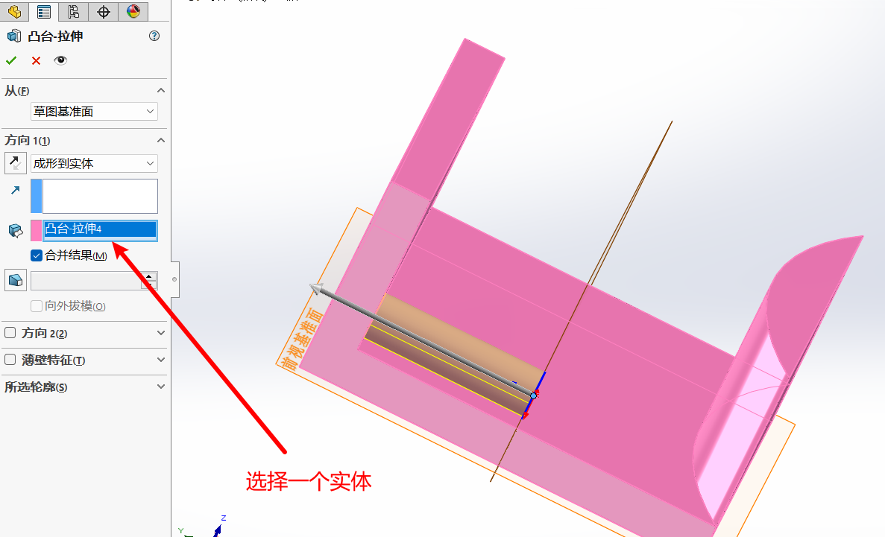

## 目录
<!-- TOC -->
- [目录](#目录)
- [1.软件介绍](#1软件介绍)
- [2.软件基本设置](#2软件基本设置)
  - [2.1 新建](#21-新建)
  - [2.2 界面介绍](#22-界面介绍)
    - [菜单栏](#菜单栏)
    - [标准工具栏](#标准工具栏)
    - [状态栏](#状态栏)
    - [FeatureManager 设计树](#featuremanager-设计树)
    - [绘图区](#绘图区)
  - [2.3 鼠标的各种使用方法：](#23-鼠标的各种使用方法)
- [3.草图模块](#3草图模块)
  - [3.1 草图的进入和退出，直线的相关命令](#31-草图的进入和退出直线的相关命令)
    - [草图的进入退出](#草图的进入退出)
    - [直线的相关命令](#直线的相关命令)
  - [3.2 圆，矩形，圆弧，槽口命令](#32-圆矩形圆弧槽口命令)
    - [圆](#圆)
    - [矩形](#矩形)
    - [圆弧](#圆弧)
    - [槽口](#槽口)
  - [3.3 多边形，椭圆，点，文字，样条曲线](#33-多边形椭圆点文字样条曲线)
    - [多边形](#多边形)
    - [椭圆](#椭圆)
    - [点](#点)
    - [文字](#文字)
    - [样条曲线](#样条曲线)
    - [补充](#补充)
      - [上色草图轮廓](#上色草图轮廓)
      - [正视于](#正视于)
      - [视图定向](#视图定向)
  - [3.4 鼠标笔势，图形的选择和删除](#34-鼠标笔势图形的选择和删除)
    - [鼠标笔势](#鼠标笔势)
    - [图形的选择和删除](#图形的选择和删除)
  - [3.5 软件自动添加几何约束](#35-软件自动添加几何约束)
  - [3.6 手动添加几何约束](#36-手动添加几何约束)
  - [3.7 智能尺寸和草图的状态](#37-智能尺寸和草图的状态)
    - [智能尺寸](#智能尺寸)
    - [草图的状态](#草图的状态)
    - [尺寸的分类](#尺寸的分类)
      - [驱动尺寸](#驱动尺寸)
      - [从动尺寸](#从动尺寸)
  - [3.8 倒圆角，倒斜角，剪裁实体](#38-倒圆角倒斜角剪裁实体)
    - [倒圆角](#倒圆角)
    - [倒斜角](#倒斜角)
    - [剪裁实体](#剪裁实体)
  - [3.9 文档属性的认识](#39-文档属性的认识)
  - [3.10 草图按第一个尺寸进行缩放的优点](#310-草图按第一个尺寸进行缩放的优点)
  - [3.11 镜像实体](#311-镜像实体)
  - [3.12 线性阵列](#312-线性阵列)
  - [3.13 圆周阵列](#313-圆周阵列)
  - [3.14 等距实体和延伸实体](#314-等距实体和延伸实体)
    - [等距实体](#等距实体)
    - [延伸实体](#延伸实体)
  - [3.15 转折线命令](#315-转折线命令)
  - [3.16 转换实体引用](#316-转换实体引用)
  - [3.17 分割实体](#317-分割实体)
  - [3.18 移动，复制，旋转，缩放，伸展实体](#318-移动复制旋转缩放伸展实体)
    - [旋转实体](#旋转实体)
    - [缩放实体](#缩放实体)
    - [移动实体](#移动实体)
    - [复制实体](#复制实体)
    - [伸展实体](#伸展实体)
  - [3.19 小结](#319-小结)
- [4.特征模块](#4特征模块)
  - [4.1 生成特征的两种方式](#41-生成特征的两种方式)
  - [4.2 拉伸凸台/基体](#42-拉伸凸台基体)
    - [拉伸起点](#拉伸起点)
    - [拉伸方式](#拉伸方式)
<!-- /TOC -->

## 1.软件介绍

SolidWorks 软件是美国 SolidWorks 公司 (1997 年被法国达索公司收购) 推出的基于 Windows 的机械设计软件。SolidWorks 是基于 Windows 平台的全参数化特征造型软件，它可以十分方便地实现复杂的三维零件实体造型、复杂装配和生成工程图等等。

SolidWorks 因其功能强大、易学易用等特点，目前已经成为市场上领先的、主流的三维 CAD 解决方案软件。其应用涉及平面工程制图、三维造型、加工制造、非标自动化等领域。

SolidWorks 简称 **SW**

## 2.软件基本设置

### 2.1 新建
打开软件双击空白处，然后就可以选择新建以下三种文件。

### 2.2 界面介绍

#### 菜单栏
菜单栏中包含 SOLIDWORKS 的所有操作命令。
#### 标准工具栏
与其他标准的 Windows 程序一样，标准工具栏中的工具按钮用来对文件执行最基本的操作，如新建、打开、保存、打印等。
#### 状态栏
状态栏位于 SOLIDWORKS 用户界面底端的水平区域，提供了当前窗口中正在编辑的内容的状态，以及位置坐标、草图状态等信息。
#### FeatureManager 设计树
FeatureManager 设计树位于 SOLIDWORKS 用户界面的左侧，是 SOLIDWORKS 中比较常用的部分。它提供了软件操作的一个大纲视图，用户可以方便查看模型的构造等相关信息。
#### 绘图区
绘图区是进行零件设计、制作工程图、装配的主要操作窗口。

### 2.3 鼠标的各种使用方法：
**鼠标左键**：选择功能
**滚轮的滚动**：视图的缩放
**按住键盘上的 Ctrl 和按住滚轮移动**：平移视图
**按住滚轮移动**：翻转视图 (方便各个视角查看)
**连续按下滚轮两次**：可以显示全部图形
**鼠标右键**：在不同的位置与场景有不同的功能,后续会慢慢介绍

## 3.草图模块

### 3.1 草图的进入和退出，直线的相关命令

#### 草图的进入退出
点击草图绘制，然后选择一个基准面

绘制完草图，点击如图左上角或右上角退出草图

#### 直线的相关命令
**首先进入草图绘制模式:**
**直线**：L (英文状态下，快捷键) 
**退出命令**：Esc 
**重复上个命令**：回车键 (Enter)
**撤销 (或叫回撤)**:Ctrl+Z (回到上一步) 
**直线和圆弧的切换**：按键盘上的 A (英文状态下)

也可以直接点击操作面板上的直线图标，如图下：

### 3.2 圆，矩形，圆弧，槽口命令

这些图标都在上面那个图可以看见，和直线图标挨着，以下介绍一些常用的：

#### 圆
分别是圆心半径圆、周边圆

#### 矩形
前两个分别是边角矩形、中心矩形

添加构造直线(中心线又叫构造线，起辅助作用，但是不参与特征)，从边角和中点的区别：

#### 圆弧
分别是圆心起始终止画弧、3 点圆弧、切线弧

#### 槽口
直槽口、中心点直槽口、3 点圆弧槽口、中心点圆弧槽口

### 3.3 多边形，椭圆，点，文字，样条曲线

#### 多边形
各条边的边长都相等,可以选择内接圆或者外接圆

#### 椭圆
这里常用的有两种：椭圆和部分椭圆

#### 点
绘制一个点

#### 文字
可以在草图中绘制你想要的文字，文字位置默认在原点，也可以通过拖动改变文字的位置

#### 样条曲线
样条曲线是指通过给定一组控制点得到的一条光滑曲线，曲线在各点处的一阶和二阶导数连续（端点除外），它具有连续的、曲率变化均匀的特点。样条曲线在一般的机械设计中应用并不多，但在造型设计等领域的应用非常常见。

有三个要介绍的：样条曲线，样式样条曲线，方程式驱动的曲线

**样条曲线**:由曲线上的点进行控制
**样式样条曲线**:由虚线上的点进行控制
**方程式驱动的曲线**:由方程进行控制，通过输入方程y 以及x的取值范围可以生成，默认也是在原点，可以拖动

#### 补充

##### 上色草图轮廓

启用后可以将封闭图形进行上色，可以更好的分辨

##### 正视于

在翻转草图的时候点击正视于可以快速回到垂直于草图视图的视角

##### 视图定向
可以快速定位到当前草图的上视图，左视图等各个视图

### 3.4 鼠标笔势，图形的选择和删除

#### 鼠标笔势
使用鼠标笔势可以加快我们的绘图效率，长按鼠标右键呼出笔势

还未设置鼠标笔势可以先：选择上方的小齿轮右边的小三角形 -> 选择自定义 -> 选择鼠标笔势一栏 -> 勾上启用鼠标笔势

#### 图形的选择和删除

首先处于选择状态下：
**图形的选择方式**：点选、框选(选中的实体呈现青色)
从左至右：实体全部在框里面才会被选中；
从右至左：实体只要和框有接触就会被选中。

**图形的删除**：键盘上的 Delete

### 3.5 软件自动添加几何约束

**几何约束**：控制草图的位置、形状以及草图里面各实体之间的关系等
首先要记得开启**关系捕捉**

在画图的时候，可以看见黄色的小图标，意思是显示在自动捕捉约束中，并且画完后这个小图标变成绿色，即该实体被添加了该约束

还有可能是白色小图标，这种情况下画完之后不会添加该约束

以下是常见的几何关系：

### 3.6 手动添加几何约束

**1软件中的 “添加几何关系”**

**2键盘上的 Ctrl 键 (常用方式)**
按住ctrl就可以进行实体的多个选择，选中后就可以在左边选择几何关系

**3通常直接框选也可以 (重点掌握)**
[图形的选择](#图形的选择和删除)

### 3.7 智能尺寸和草图的状态

#### 智能尺寸
主要介绍前面三个：**智能尺寸，水平尺寸，垂直尺寸**

**智能尺寸**顾名思义就是带点智能的尺寸标注，可以根据鼠标的动作识别你想要标注的是什么的尺寸，如下：
标注直线的的时候鼠标往左边或者右边进行挪动，就自动识别出你想要标注的是**竖直尺寸**，往上或下就是**水平尺寸**

**水平尺寸，竖直尺寸**这个就是字面意思了

圆弧半径，圆的直径，以及两条线之间的距离，角度等等都可以使用智能尺寸快速标注

默认情况下都是标注圆心，所以想标注圆上的点或者弧长可以使用以下的一些方法：
**圆周上的尺寸标注**：按住键盘上的 Shift
**圆弧弧长的标注**：依次点选两个端点、圆弧

#### 草图的状态

在草图绘制中这个软件要求必须要和**原点发生位置关联**，如下，原本为蓝色代表欠定义，添加了与原点的关系后草图变为黑色，代表完全定义了

现在继续添加一个角度的约束，草图变为黄色，显示过定义，所以并不能随意添加约束，确保草图处于完全定义的状态

#### 尺寸的分类

分为**驱动尺寸**和**从动尺寸**：

##### 驱动尺寸
我们通过了两个几何约束和三个尺寸约束将草图完全定义了，这里将确定草图的**大小，尺寸，位置**的尺寸称为驱动尺寸

##### 从动尺寸
继续在三角形的另一条边加一个尺寸约束，软件会提示你设置为驱动尺寸或者从动尺寸，选择驱动尺寸会导致草图过定义(因为草图已经完全定义，多一个约束反而不行)，选择设置为从动尺寸将会看到一个灰色的标注，上面的值是根据驱动尺寸所得出的，驱动尺寸的变化会使得从动尺寸发生变化

### 3.8 倒圆角，倒斜角，剪裁实体

#### 倒圆角
**倒角**：倒圆角、倒斜角。
**倒圆角**：将两个草图实体相交处的边角圆角化、以创建一条**切线弧**。可以选择两个草图实体或选择一个边角。如果选择的实体不相交，则实体将延伸到带倒角边角的虚拟交叉点。两个选项框一般都勾选上。

点击绘制圆角，选择要圆角的实体(点，两条直线等)，可以设置圆角的半径，绘制完成后圆角的半径会自动标注。下面的选项中，标注每个圆角的尺寸意思是会将每一个圆角标注一遍半径，没勾上时绘制多个半径相等的圆角则只会自动标注其中一个，其它的圆角使用相等的几何约束

**注意**：构造线从中点引出的中心矩形最好不要用圆角
没注意可能出现以下情况：

点击是后发现草图过定义：
但是将几何约束中的中点约束删除就可以了

其实是因为绘制圆角的时候会挖掉线段的一部分，之前在中点的位置的点现在并不是位于中点导致了过定义警告。

#### 倒斜角
**倒斜角**：用一条斜线连接两个对象。
两种方式：**距离 - 距离**，**角度距离**。其中距离 - 距离可分为相等和不相等。在这几种方式中**距离 - 距离**中的相等最常应用。

**距离 - 距离**：设置倒斜角两边的尺寸绘制
**角度距离**：设置一条边的距离和一个角度绘制

#### 剪裁实体
可以方便的裁剪掉多余的不想要的部分
**图形的修剪**：有 5 种方式，**强劲剪裁**最常应用，大家目前掌握这种即可。
**注意**：剪裁以后有时候会丢失几何约束和尺寸约束，从而使完全定义变为欠定义，这个时候要补上丢失的约束。

轨迹为灰色的线条，可以将碰到的实体多余部分删除

### 3.9 文档属性的认识

这里有一个常见的小问题，就是默认的尺寸标注的数值不太清晰(我这里是sw2022)，那么可以通过以下的方式进行修改：

具体步骤：新建一个空白零件 -> 选项 -> 文档属性 -> 尺寸 -> 更改想要的字体 -> 确定 -> 保存为.prtdot 格式 -> 文件位置会自动跳到零件模板的位置 -> 命名时与之前的一致 -> 将原来的替换

这样下次新建零件的时候就是默认用的修改的字体了，其他的文档属性也可以用同样的进行修改，步骤一样。

### 3.10 草图按第一个尺寸进行缩放的优点

**可以防止草图的严重变形**

**注意**：有时候即使勾选上了这个，草图还是会变形，所以绘制草图时为了最好边画边约束。

### 3.11 镜像实体

**镜像**：通过中心线（构造几何线）将一侧的草图实体对称到另外一侧得到新的草图

**注意**：绘制草图时为了防止草图变形严重，建议边画边约束。

**步骤**：点击镜像实体 -> 选择构造线和要镜像的实体 -> 确定

**复制**：不打钩镜像完成后就只存在镜像后的实体，原来的实体会消失

**建议**：可以直接用框选，然后点击镜像实体就可以快速镜像

### 3.12 线性阵列

**线性阵列**：将草图实体沿一个或者两个方向复制生成多个排列图形。

### 3.13 圆周阵列

**圆周阵列**：将草图实体沿一个指定大小的圆弧进行环状阵列。

操作和一些参数与线性阵列相似，简单看看

### 3.14 等距实体和延伸实体

#### 等距实体

**等距实体**：按照指定的距离偏移一个或者多个草图实体得到新的草图。**如果原始实体发生改变，则偏移实体也会改变。**
**直线等距**：保持平行。
**圆或圆弧等距**：保持同心以及半径的变化值等于等距值。

#### 延伸实体

**将草图实体延伸最近的边界**。在延伸草图实体时，如果两个方向都可以延伸，而只需要单一方向的延伸时，光标靠近需要延伸的一侧即可 (在执行该命令的过程中，实体延伸的结果预览会以**红色**显示)。

### 3.15 转折线命令

**转折线**：将草图实体线条（**直线**）以转折线的形式变为新的草图实体并自动添加几何约束。

可以对比以下添加了哪些约束

### 3.16 转换实体引用

功能是通过已有模型或草图，将其边线、草图轮廓等投影到**当前绘制草图的基准面**上形成新草图实体，引用实体改变，转换得到的新草图也相应改变，**在草图绘制和自上而下设计中常用**

### 3.17 分割实体

将一个**连续**的草图实体分割为两个草图实体，以方便进行其他操作。如果想再合并，选中分割点，按键盘上的 Delete 即可 (**注意需要保证分割点两端的线型均为实线**)
**直线分割**：自动添加共线的几何约束。
**圆或者圆弧分割**：自动添加全等 (既同心又等大) 的几何约束。

### 3.18 移动，复制，旋转，缩放，伸展实体

#### 旋转实体
(用得不多)
通过旋转**旋转中心**及要旋转的度数来旋转草图实体。

#### 缩放实体
(了解即可，用得很少)
通过基准点和比例因子对草图实体进行缩放。也可以根据需要在保留原缩放对象的基础上缩放草图。

#### 移动实体
 (了解即可，用得很少)
移动一个或者多个草图实体,原来的实体会消失

草图处于**欠定义**的状态时，如果想
移动草图的某个点，鼠标左键 **(处
于选择状态)** 接触到这个点按住不
松开直接拖动即可。如果想平移某
一部分草图实体，选中这部分实体，
按住鼠标左键 (**处于选择状态**) 不松
开接触到这部分的**除去点**的任意位
置直接拖动即可。

#### 复制实体 
(了解即可，用得很少)
用于复制一个或者多个草图实体。

和移动实体的参数，使用方法一样，只不过最后完成的时候保留**原来和复制的**实体

#### 伸展实体 
(了解即可，用得很少)
通过基准点和坐标点对草图实体进行伸展。

和移动实体使用方法相似，使用时还可能破坏约束关系，用的少

### 3.19 小结

第三章到这里就差不多了，大家在遇到比较复杂的图形时不要慌张，找准**基准点**，注意观察，**边画边约束**！以及裁剪过程中一旦发现欠定义，要马上添加约束，不要等到裁剪完毕后再来补约束因为这个时候就很难找到丢失的约束！

下面就要开始进入特征模块了

## 4.特征模块

### 4.1 生成特征的两种方式

没有出现特征这一栏可以右键旁边的草图或者其它的 -> 选项卡 -> 勾上特征

**先草图后特征**：先绘制好草图，然后直接生成想要的特征。

**先特征后草图**：先确定想要的特征，再绘制草图。

### 4.2 拉伸凸台/基体

**拉伸凸台/基体**：将一个二维草图平面按着其设定方式沿着**与草图平面垂直的方向**拉伸一定距离形成三维实体。**草图轮廓要求闭环，草图轮廓最好不要自我相交，以及不能有多余的线条。建议初学者的草图轮廓封闭。**

**注意**：构造线不参与特征 

#### 拉伸起点

**1.草图基准面**
在当前的草图基准面上直接进行拉伸

**2.曲面/面/基准面**
自己指定一个面，在选取的面上进行拉伸

**3.顶点**
相当于将草图平移到该顶点相交的位置，然后进行拉伸

**4.等距**
相当于在该方向上平移当前草图一个给定的距离，然后再进行拉伸

**5.补充**

#### 拉伸方式

**1.给定深度**
字面意思，给定多深，就拉伸多长

**2.完全贯穿**
会成型到该方向的模型的**最外侧的一个面**

**3.成形到顶点**
相当于将当前草图的基准面进行平移，平移到刚好与顶点相交，然后将选取的轮廓成型到这边

**4.成形到面**
成型到选取的任意面上

**5.到离指定面指定的距离**
给定距离和指定平面，将轮廓拉伸至离指定平面为给定距离的位置

**6.成形到实体**
选择一个实体，将轮廓成型至该方向上离实体最近的一个面

**7.两侧对称**
给定总深度，然后两侧进行成型

