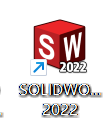
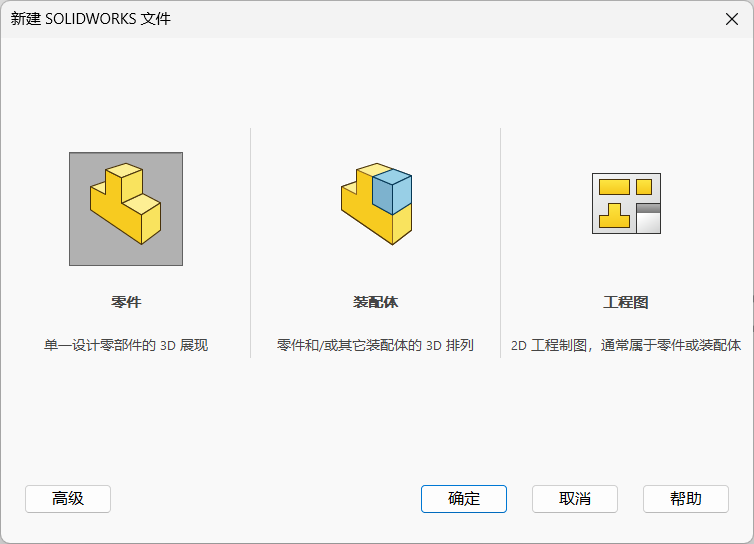
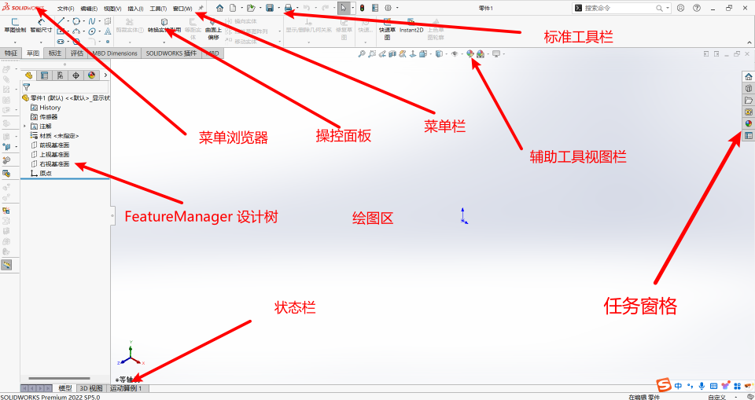

## 目录
<!-- TOC -->
- [目录](#目录)
- [1.软件介绍](#1软件介绍)
- [2.软件基本设置](#2软件基本设置)
  - [2.1 新建](#21-新建)
  - [2.2 界面介绍](#22-界面介绍)
  - [2.3 鼠标的各种使用方法：](#23-鼠标的各种使用方法)
<!-- /TOC -->

## 1.软件介绍

SolidWorks 软件是美国 SolidWorks 公司 (1997 年被法国达索公司收购) 推出的基于 Windows 的机械设计软件。SolidWorks 是基于 Windows 平台的全参数化特征造型软件，它可以十分方便地实现复杂的三维零件实体造型、复杂装配和生成工程图等等。

SolidWorks 因其功能强大、易学易用等特点，目前已经成为市场上领先的、主流的三维 CAD 解决方案软件。其应用涉及平面工程制图、三维造型、加工制造、非标自动化等领域。

SolidWorks 简称 **SW**

## 2.软件基本设置

### 2.1 新建
打开软件双击空白处，然后就可以选择新建以下三种文件。

### 2.2 界面介绍

#### 菜单栏
菜单栏中包含 SOLIDWORKS 的所有操作命令。
#### 标准工具栏
与其他标准的 Windows 程序一样，标准工具栏中的工具按钮用来对文件执行最基本的操作，如新建、打开、保存、打印等。
#### 状态栏
状态栏位于 SOLIDWORKS 用户界面底端的水平区域，提供了当前窗口中正在编辑的内容的状态，以及位置坐标、草图状态等信息。
#### FeatureManager 设计树
FeatureManager 设计树位于 SOLIDWORKS 用户界面的左侧，是 SOLIDWORKS 中比较常用的部分。它提供了软件操作的一个大纲视图，用户可以方便查看模型的构造等相关信息。
#### 绘图区
绘图区是进行零件设计、制作工程图、装配的主要操作窗口。

### 2.3 鼠标的各种使用方法：
**鼠标左键**：选择功能
**滚轮的滚动**：视图的缩放
**按住键盘上的 Ctrl 和按住滚轮移动**：平移视图
**按住滚轮移动**：翻转视图 (方便各个视角查看)
**连续按下滚轮两次**：可以显示全部图形
**鼠标右键**：在不同的位置与场景有不同的功能,后续会慢慢介绍

