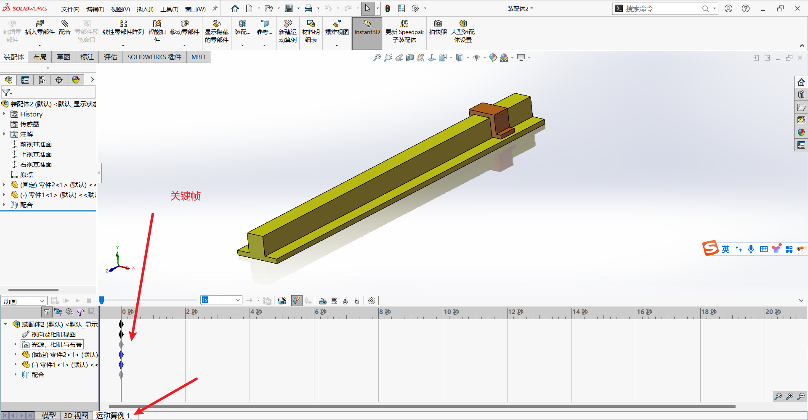
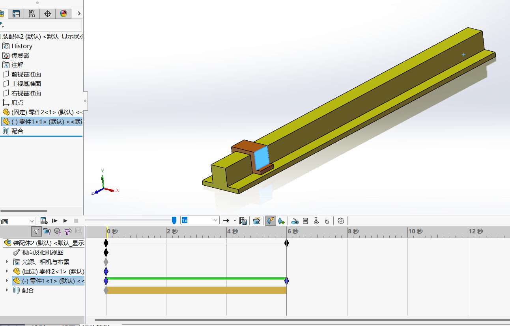
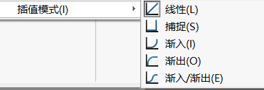
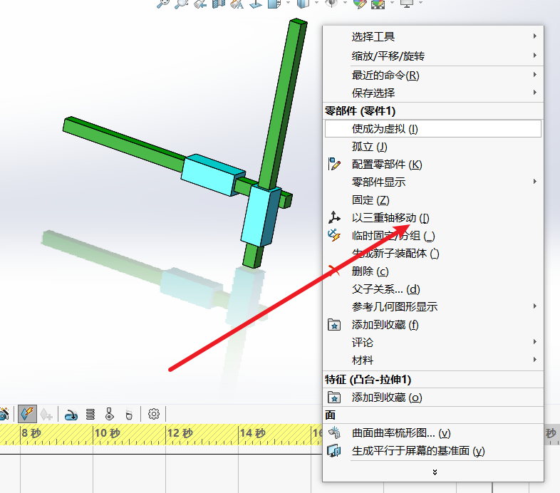
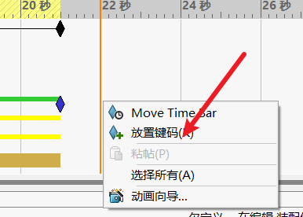

## 目录

- [目录](#目录)
- [简单移动](#简单移动)
- [多自由度运动](#多自由度运动)

## 简单移动

单击运动算例来到动画制作的界面

和剪视频差不多，移动一下，打一个关键帧，del键删除关键帧

先移动时间轴，然后移动小滑块，软件会自动打上关键帧，每一个关键帧对应左边的零件或者视图等属性

右键关键帧，可以选择插值模式，这里的图像斜率代表运动的速度，

制作完成就可以点击保存动画，导出视频

## 多自由度运动

有时候只想要移动其中的一个零件，但是另一个零件跟着一起运动了，这时候可以右键零件，点击三重轴移动，这样就可以单独移动了

想要制作某个零件停滞一段时间的动画，可以先拖动时间轴到想要的位置，然后右键放置键码，这样中间就是空的动画

