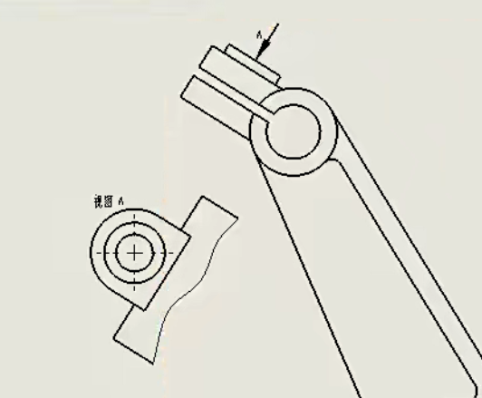

## 目录

- [目录](#目录)
- [标准视图转换和标注出图](#标准视图转换和标注出图)
  - [工作环境](#工作环境)
  - [标准三视图的创建](#标准三视图的创建)
  - [视图的基本设置](#视图的基本设置)
  - [尺寸标注](#尺寸标注)
  - [图纸转CAD](#图纸转cad)
- [剖视图应用以及出图表达技能](#剖视图应用以及出图表达技能)
  - [剖视图](#剖视图)
  - [裁剪视图](#裁剪视图)
  - [局部视图](#局部视图)
  - [断开的剖视图](#断开的剖视图)
  - [半剖视图](#半剖视图)
  - [断裂视图](#断裂视图)
  - [辅助视图](#辅助视图)
- [公差符号标注及其图纸编辑](#公差符号标注及其图纸编辑)

## 标准视图转换和标注出图

### 工作环境

这个就是工程图的不同种类

1. 根据需要选择一个图框模版
2. 图框跟打印无关，一般公司都有
固定的图框
3. 这里只是用于转图形用

新建一个空白的工程图，右键图纸空白的地方，找到属性一栏，这里面可以修改图纸的参数，可调整比例，视角等

1. 比例只是显示大小而已；跟打印无关
2. 第一角与第三角用于确定视图投影方向

在右侧的视图调色板可对应导入需要的视图（前提是要先打开零件在另一个窗口），否则也可以点击旁边的...直接在文件夹中找到对应的模型文件

### 标准三视图的创建

**法1**

创建出三视图后可以在图纸属性中选择第一或者第三视角，三视图可以拖动，按del键可以删除

**方法2**：右侧视图调色板，拖动调入

**方法3**：右侧先导一个，再投影生成

投影视图：通过现有的视图展开新视图来添加投影视图

### 视图的基本设置

1. 选中对应视图，左边会显示相关设置
可进行（显示，比例等调整）
2. 选中对应视图，右键（有很多设置项）

**常用的样式**

显示样式那边一般可以选用第二个，用虚线显示隐藏线

右键图纸，选择切边 -> 切边不可见，那条切边一般不需要在图纸中表达出来的

### 尺寸标注

先右键工具栏，打开图层和线型，这里的使用方法和CAD就差不多了，打开之后在软件下方可以看见，可以更改图层，以及线宽，颜色等

接下来说一下注解

1. 注解--标注（方法跟草图标注一样）
2. 同时左侧框中可设置与修改更多参数

### 图纸转CAD

1. Solidworks创建好视图后----文件菜单（另存为）----格式（DWG、DXF）均可

2. CAD打开可做进一步优化或标注，打印出图就可以了
   
3. 实际上Solidorks直接就可以打印出图基本上不用通过CAD

**补充**：Solidworks创建好视图后----文件菜单（另存为）----格式PDF（方法同保存DWG相同）

## 剖视图应用以及出图表达技能

### 剖视图

使模型内部结构得以显示，便于观察

选中命令，选择一种剖切方式，选择点确定基准面进行剖视图，可以自行翻转方向

**轴的剖法**

在剖切这个键槽的时候，剖视图一般是放在剖切位置的下方，右键剖视图，在视图对齐中选择**解除对齐关系**

也可以在要放下剖视图之前按住ctrl，就可以随意拖动

现在剖视图还不太正确，点击横截剖面就可以使剖视图只显示剖出来的部分

**修改剖切线**

有时候想剖切一半的轴，可以先点击编辑草图，进入之后就可以直接修改剖切线，然后退出草图就自动剖切好了

也可以在设计树中下拉剖切视图，点击切除线，然后进行编辑

### 裁剪视图

先在图上绘制想要保留下来的区域的草图，然后点击裁剪视图，就可以将其他的部分裁剪掉

### 局部视图

点击局部视图，它让我们绘制一个圆，现在已经是直线命令了，直接在想要的地方画一个圆，然后局部视图就出来了（自动放大两倍）

也可以用样条曲线画一个轮廓出来，然后点击局部视图

### 断开的剖视图

先要自己画一个轮廓出来，然后选择一条边线作为要剖切的部分的参考，然后点击确认就好了

### 半剖视图

在剖面视图中选择半剖，要注意这几个的剖切的投影关系，前面4个是左右，后面4个是上下

例子：

### 断裂视图

点击命令，直接在想要切断的部分点击两下就好了

### 辅助视图

制作下图的视图A，可以使用辅助视图，点击辅助视图，选择一条边线，会生成垂直于那一条边线的视图，可以使用裁剪视图保留想要的部分

## 公差符号标注及其图纸编辑
