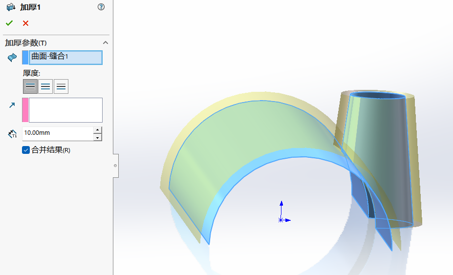

## 目录

- [目录](#目录)
- [曲面的创建和基本操作](#曲面的创建和基本操作)
  - [曲面简单介绍](#曲面简单介绍)
  - [标准曲面创建](#标准曲面创建)
    - [如何找到曲面一栏](#如何找到曲面一栏)
    - [创建曲面](#创建曲面)
  - [曲面操作](#曲面操作)
    - [剪裁曲面](#剪裁曲面)
    - [曲面合并](#曲面合并)
    - [曲面加厚](#曲面加厚)

## 曲面的创建和基本操作

### 曲面简单介绍

曲面不是实体，一般用户外观复杂产品建模；构建曲面可通过标准的拉伸，旋转等建模方法（但这些只能做出标准的曲面）；复杂曲面需要先**构建用于创建曲面的线框**，再通过边界或放样等高级曲面功能创建出曲面。

多个曲面（形成的封闭外观）合并之后，会自动生成实体；非封闭外观，可通过加厚生成实体！

### 标准曲面创建

#### 如何找到曲面一栏
右键灰色那一栏 -> 选项卡 -> 勾选上曲面

#### 创建曲面

**操作方法**：与实体创建主法一样（不过生成的是曲面）单一的草图轮廓也可以直接用拉伸，旋转等命令创建为曲面

拉伸曲面和旋转曲面，这个和拉伸凸台，旋转凸台都是一样的，参数就不过多解释

### 曲面操作

#### 剪裁曲面
操作方法：修剪工具体---裁剪曲面（注意点的位置，很重要）保留/移除选择

#### 曲面合并
将两个或多个相邻、不相交的曲面组合为**一个曲面实体**。曲面必须在边线处接合

如图曲面实体由两个变成一个，未缝合前二个面相交处有蓝色的边；缝合后相交的蓝色边会消失！缝合后就不是二个曲面了，参与缝合的曲面会形成一个面！

#### 曲面加厚

单一的曲面直接可以加厚；非单一的曲面，先合并再加厚；加厚以后曲面会变成实体

加厚完，曲面实体消失，变成了一个实体

