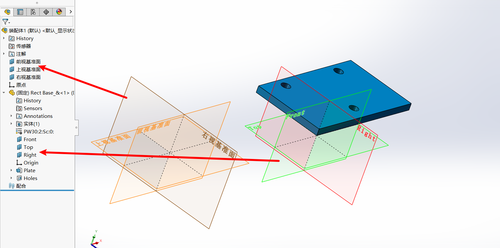
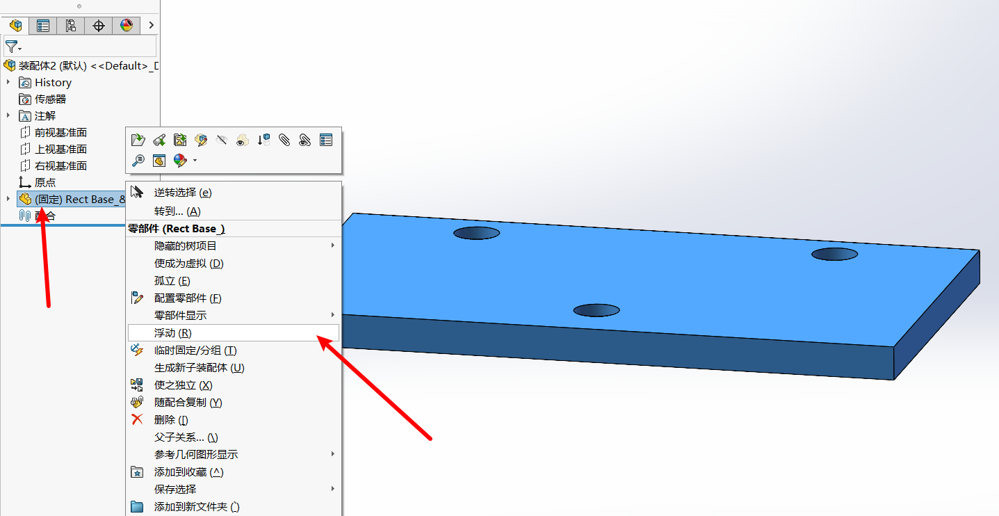

## 目录

- [目录](#目录)
- [标准装配技能](#标准装配技能)
  - [装配图环境概述](#装配图环境概述)
  - [零件导入与移动](#零件导入与移动)
  - [装配](#装配)
    - [装配关系](#装配关系)
    - [配合](#配合)
    - [配合关系的修改](#配合关系的修改)
- [装配修改与编辑](#装配修改与编辑)
  - [装配体阵列与镜像](#装配体阵列与镜像)
  - [装配体特征修改](#装配体特征修改)
  - [爆炸图制作](#爆炸图制作)

## 标准装配技能

在现实工作当中，不可能只是画零件图；任何产品与机械设备都是多个零部件组成，现在客户及工作需求，一般都是要看装配效果图纸。通过装配图，可方便观察各个零部件之间配合干涉及功能。

### 装配图环境概述

基准面：装配基准面+零件基准面

**装配图说明**

1. 需要提前画好产品的各个零部件
2. 将一个完整的产品或设备所有零件放置到一个
文件夹
3. 如果是多实体建模的拆分零件，也需要放置到
一个文件夹
4. 装配体保存需要将文件保存到同一个文件夹
5. 如果要将装配图发给别人，需要将整个文件夹
发给别人，否则对方打开是错误，零件丢失！

### 零件导入与移动

在插入零部件中点击浏览来到文件夹中，就可以选择想要导入的零件

零件导入时可以选择一个进行导入，也可以框选多个进行导入

选择完零件进入软件，单击一下就可以将零件放下

零件在设计树中有两种状态，分别是**固定**和**浮动**，固定会显示固定两个字，浮动则是用-表示，右键零件可以改变状态，浮动的零件可以左键移动，右键旋转。

**注意：**

1. 第1个导入零件建议先导**主体**
2. 主体零件建议**固定**
3. 可以**Ctrl+左键**---复制零件
4. 装配的顺序建议按实际进行

### 装配

#### 装配关系

装配关系剖析（装配需要**2个对象以上**条件）
**重合**：将选定的（点、线、面、轴等）需要2个对象给定重合关系，常见组合（**点+点**；**点+线**；**面+面**；**面+边**；**线+轴**等）
**平行**：将选定的（边、面）需要2个对象给定平行关系，常见组合（边+边；面+面）
**垂直**：将选定的（边、面）需要2个对象给他定垂直关系，常见组合（边+边；面+面）
**相切**：将选的（边、面）需要有圆柱面，常见组合（圆与圆；边与圆）
**同轴**：将选的二个圆柱面，形成同轴心配合关系
**距离**：可在配合时同时指定二个对象之间的距离
**角度**：可在配合时同时指定二个对象之间的角度

#### 配合

进行装配时可以通过选择两个对象，在旁边弹出的小框框中选择关系，也可以进入配合选项，再选择要配合的对象，然后进行配合

#### 配合关系的修改

可以在设计树中下拉配合，选中要修改的关系，然后右键编辑特征进行修改

也可以先选中零件，在左上方的小弹窗中选中想要修改的关系，然后右键编辑特征进行修改

## 装配修改与编辑

### 装配体阵列与镜像
### 装配体特征修改
### 爆炸图制作
