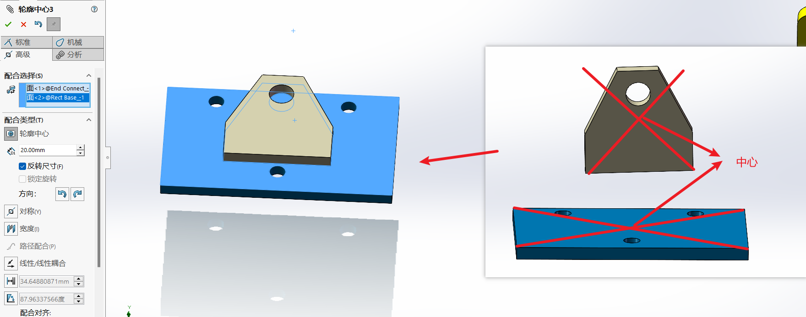

## 目录

- [目录](#目录)
- [标准装配技能](#标准装配技能)
  - [装配图环境概述](#装配图环境概述)
  - [零件导入与移动](#零件导入与移动)
  - [装配](#装配)
    - [装配关系](#装配关系)
    - [配合](#配合)
    - [配合关系的修改](#配合关系的修改)
    - [智能装配](#智能装配)
- [装配修改与编辑](#装配修改与编辑)
  - [装配体阵列与镜像](#装配体阵列与镜像)
  - [随配合复制](#随配合复制)
  - [装配体特征修改](#装配体特征修改)
  - [爆炸图制作](#爆炸图制作)
- [高级配合与机械配合](#高级配合与机械配合)
  - [高级配合](#高级配合)
  - [机械配合](#机械配合)

## 标准装配技能

在现实工作当中，不可能只是画零件图；任何产品与机械设备都是多个零部件组成，现在客户及工作需求，一般都是要看装配效果图纸。通过装配图，可方便观察各个零部件之间配合干涉及功能。

### 装配图环境概述

基准面：装配基准面+零件基准面

**装配图说明**

1. 需要提前画好产品的各个零部件
2. 将一个完整的产品或设备所有零件放置到一个
文件夹
3. 如果是多实体建模的拆分零件，也需要放置到
一个文件夹
4. 装配体保存需要将文件保存到同一个文件夹
5. 如果要将装配图发给别人，需要将整个文件夹
发给别人，否则对方打开是错误，零件丢失！

### 零件导入与移动

在插入零部件中点击浏览来到文件夹中，就可以选择想要导入的零件

零件导入时可以选择一个进行导入，也可以框选多个进行导入

选择完零件进入软件，单击一下就可以将零件放下

零件在设计树中有两种状态，分别是**固定**和**浮动**，固定会显示固定两个字，浮动则是用-表示，右键零件可以改变状态，浮动的零件可以左键移动，右键旋转。

**注意：**

1. 第1个导入零件建议先导**主体**
2. 主体零件建议**固定**
3. 可以**Ctrl+左键**---复制零件
4. 装配的顺序建议按实际进行

### 装配

#### 装配关系

装配关系剖析（装配需要**2个对象以上**条件）
**重合**：将选定的（点、线、面、轴等）需要2个对象给定重合关系，常见组合（**点+点**；**点+线**；**面+面**；**面+边**；**线+轴**等）
**平行**：将选定的（边、面）需要2个对象给定平行关系，常见组合（边+边；面+面）
**垂直**：将选定的（边、面）需要2个对象给他定垂直关系，常见组合（边+边；面+面）
**相切**：将选的（边、面）需要有圆柱面，常见组合（圆与圆；边与圆）
**同轴**：将选的二个圆柱面，形成同轴心配合关系
**距离**：可在配合时同时指定二个对象之间的距离
**角度**：可在配合时同时指定二个对象之间的角度

#### 配合

进行装配时可以通过选择两个对象，在旁边弹出的小框框中选择关系，也可以进入配合选项，再选择要配合的对象，然后进行配合

#### 配合关系的修改

可以在设计树中下拉配合，选中要修改的关系，然后右键编辑特征进行修改

也可以先选中零件，在左上方的小弹窗中选中想要修改的关系，然后右键编辑特征进行修改

#### 智能装配

先选中你想要配合的一个面，然后在移动零件的时候按住alt键，将两个要配合的面移动到一起，就会出现智能装配的标记，然后直接选择配合关系就好了

## 装配修改与编辑

### 装配体阵列与镜像

**说明**：与建模空间阵列复制和镜像一样，直接去特征模块中查看

### 随配合复制
先选择想要复制的零部件，选择完毕点击右上角的下一步按钮

可以看见，这里有4个配合关系用于确定了这两个零件的位置，现在我们要更改其中的配合关系，使其发生一些变化

下面是我想要的效果图，有些配合关系还是和原来一样就好了，只需要变化其中的一两个，每次更改时，零件上面都会高亮显示相关的点线面，大家可以自己好好对比

### 装配体特征修改
**操作方法1**：打开零件---进入建模空间修改---其修改的特征也会同步更新到装配空间一两个，
**操作方法2**：装配空间 插入--特征（可直接进行打孔，圆角等操作

### 爆炸图制作

后面更新

## 高级配合与机械配合

### 高级配合

**轮廓中心**：将二个对象中心进行配合

**对称**：通过一个基准面（将选定的二个面形成分中对称配合关系）

**宽度**：将二个特征面形成等宽度配合（选择时先选择完一个零件的二个面，再选择另一个零件的二个面）

**路径配合**：点与线之间的配合（选择一个点，再选择一个路径）

**线性/线性耦合**：在一个零件移动和另一个零件移动创建联动关系，通过调整比例指定移动距离

**距离配合**：以指定的距离，限制零件移动范围

**角度配合**：以指定的角度，限制零件开合角度范围

可以选择线之间或者面直接进行配合

### 机械配合

**皮带链**：在上方的 装配体特征 -> 皮带 / 链

1. 皮带长度一般都整数
2. 勾选生成皮带零件（可单独创建一个皮带零件）
3. 在建模模式下用扫描生成实物效果
4. 相关规范尺寸需要进一步学习机械设计选型知识

**凸轮**：相切+重合关系的配合；指定一个圆柱面、平面与另一个零件
相切面之间配合，通常在凸轮装配上进行使用。

1. 选择凸轮表面
2. 配合的推杆表面

**槽口**：零件圆柱面间的移动，比如螺栓在槽之间的移动，或者槽与槽之间的约束

1. 选择一个圆柱面与槽的面
2. 约束（自由，中心，距离，百分比可调整位置）
3. 也可以通过其他配合形式达到同样的效果

**铰链**：同心+重合+角度配合，模拟铰链效果的一种机械配合关系

**齿轮**：一般用于齿轮传动装配；通过正向与反正旋转（其中相关的参数需要精准计算）

1. 齿轮零部件不能固定
2. 选择齿轮分度圆配合
3. 也可以选择齿数配合
4. 配合好二个齿轮会产生齿轮
传动结构

**齿条小齿轮**：用于装配齿轮与齿条之间的配合；将齿轮精准装配到齿轮并能产生真实的结构运动（其中相关的参数需要精准计算）

1. 齿轮零部件不能固定
2. 距离配合需要精准计算
3. 方向可以调整

**螺旋**：将二个圆柱产生螺旋配合；一般用于螺孔与螺栓装配，可模拟真实螺旋运动效果

1. 螺母建议固定
2. 正反方向可调
3. 圈数或距离控制螺旋行程

**万向节**：将一个零件的轴与另一个零件指定的参考轴进行旋转运动

1. 选择构成万向节的零件   
2. 定义连接点

